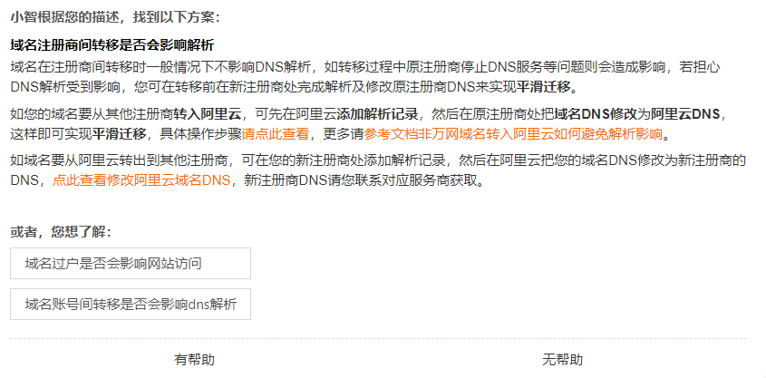

# 域名迁移方案

1. 保持国内域名不变，修改国内域名的dns解析到国内的服务器
2. 在域名迁移前，先在godaddy处的新启用一个域名，进行和国内域名一样的dns负载均衡设置，成为一个独立的功能可用域名作为备用域名。
3. 等待国内所有服务迁移到国外之后，再迁移域名，首先在godaddy处完成解析，等待解析完毕后没有问题后，把域名从阿里云迁出，迁移过程中不影响dns解析，可完成平滑迁移，如果途中出现问题，则更换为备用域名提供服务。

