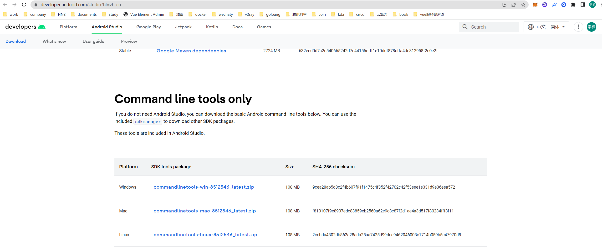

# Jenkins

## 宿主机部署（推荐）

https://pkg.jenkins.io/debian-stable/

### Jenkins Debian Packages

This is the Debian package repository of Jenkins to automate installation and upgrade. To use this repository, first add the key to your system:

```
  curl -fsSL https://pkg.jenkins.io/debian-stable/jenkins.io.key | sudo tee \
    /usr/share/keyrings/jenkins-keyring.asc > /dev/null
  
```

Then add a Jenkins apt repository entry:

```
  echo deb [signed-by=/usr/share/keyrings/jenkins-keyring.asc] \
    https://pkg.jenkins.io/debian-stable binary/ | sudo tee \
    /etc/apt/sources.list.d/jenkins.list > /dev/null
  
```


Update your local package index, then finally install Jenkins:

```
  sudo apt-get update
  sudo apt-get install fontconfig openjdk-11-jre
  sudo apt-get install jenkins
```

## docker部署

### 存在问题

**无法动态开放端口，没有横向拓展性**

不要忘了挂载数据路径

```shell
docker run -d -u root -p 6376:8080 -p 50000:50000 -v /data/jenkins_home:/var/jenkins_home -v /data/swagger-data:/doc -v /root/.ssh/xuesong:/root/.ssh jenkins/jenkins
```


## 端口配置


```shell
vim /etc/systemd/system/jenkins.service.d/override.conf
```


```shell
[Service]
Environment="JENKINS_PORT=31140"
```


## jenkins操作docker配置

将用户添加到docker组


```shell
sudo gpasswd -a ${USER} docker
```


将用户添加到root组

```shell
sudo gpasswd -a ${USER} root
```


## Flutter环境配置


### dart

https://dart.dev/get-dart

```shell
 sudo apt-get update
 sudo apt-get install apt-transport-https
 wget -qO- https://dl-ssl.google.com/linux/linux_signing_key.pub | sudo gpg --dearmor -o /usr/share/keyrings/dart.gpg
 echo 'deb [signed-by=/usr/share/keyrings/dart.gpg arch=amd64] https://storage.googleapis.com/download.dartlang.org/linux/debian stable main' | sudo tee /etc/apt/sources.list.d/dart_stable.list
 sudo apt-get update
 sudo apt-get install dart
 export PATH="$PATH:/usr/lib/dart/bin"
 echo 'export PATH="$PATH:/usr/lib/dart/bin"' >> ~/.profile
```


### fvm

https://fvm.app/docs/getting_started/installation#standalone-recommended

```shell
dart pub global activate fvm
```


### sdkmanager

https://developer.android.com/studio/command-line/sdkmanager?hl=zh-cn

https://developer.android.com/studio?hl=zh-cn




`sdkmanager` 是一个命令行工具，您可以用它来查看、安装、更新和卸载 Android SDK 的软件包。如果您使用 Android Studio，则无需使用此工具，而是可以[从 IDE 管理 SDK 软件包](https://developer.android.com/studio/intro/update?hl=zh-cn#sdk-manager)。

`sdkmanager` 工具在 Android SDK 命令行工具软件包中提供。如需使用 SDK 管理器安装某个版本的命令行工具，请按以下步骤操作：

1. 从 [Android Studio 下载页面](https://developer.android.com/studio?hl=zh-cn)中下载最新的“command line tools only”软件包，然后将其解压缩。
2. 将解压缩的 `cmdline-tools` 目录移至您选择的新目录，例如 android_sdk。这个新目录就是您的 Android SDK 目录。
3. 在解压缩的 `cmdline-tools` 目录中，创建一个名为 `latest` 的子目录。
4. 将原始 `cmdline-tools` 目录内容（包括 `lib` 目录、`bin` 目录、`NOTICE.txt` 文件和 `source.properties` 文件）移动到新创建的 `latest` 目录中。现在，您就可以从这个位置使用命令行工具了。


下载对应版本的android-sdk

```shell
./sdkmanager "platform-tools" "platforms;android-29"
```


**处理完后给jenkins用户添加android_home权限！否则会报错**

```shell
sudo chmod 777 /pathto/android_sdk -R
sudo chown jenkins:jenkins /pathto/android_sdk -R
```


### 配置环境变量

#### 方法一

在~/.bashrc中添加类似如下信息

```shell
export FVM_HOME=/root/fvm
export PUB_HOSTED_URL=https://pub.flutter-io.cn
export FLUTTER_STORAGE_BASE_URL=https://storage.flutter-io.cn
export REPO_OS_OVERRIDE=linux
export ANDROID_HOME=/root/dhenry/android_sdk
export ANDROID_SDK_ROOT=/root/dhenry/android_sdk
export PATH=${PATH}:${ANDROID_HOME}/tools
export PATH=${PATH}:${ANDROID_HOME}/platform-tools
export PATH=${PATH}:${FVM_HOME}/default/bin
export PATH=${PATH}:${D_HENRY}/android_sdk/cmdline-tools/latest/bin
```


随后在构建的shell文件中source ~/.bashrc


#### 方法二

直接在jenkins里添加环境变量


# NextCloud


## docker安装

```shell
docker run -d \
-p 8080:80 \
-v nextcloud:/var/www/html \
-v apps:/var/www/html/custom_apps \
-v config:/var/www/html/config \
-v data:/var/www/html/data \
-v theme:/var/www/html/themes/<YOUR_CUSTOM_THEME> \
nextcloud
```


## 安装好后去注册登录


## 自动置入数据


### 限制内存为512

https://github.com/nextcloud/docker/issues/1413

```shell
docker exec nextcloud su - www-data -s /bin/bash -c 'PHP_MEMORY_LIMIT=512M php -f /var/www/html/cron.php'
docker exec nextcloud su --whitelist-environment=PHP_MEMORY_LIMIT - www-data -s /bin/bash -c
```

Add `PHP_MEMORY_LIMIT=512M` to `/etc/enviroment`


### 容器化执行自动扫描

https://www.csdn.net/tags/MtTaAgysMzg2MTk4LWJsb2cO0O0O.html


```shell
#!/bin/bash
docker run -d \
-v /home/docker/nextcloud/data:/var/www/html/data \
-v /home/movies:/var/www/html/data/用户名/files/Movies \
-v /home/docker/nextcloud/custom-apps:/var/www/html/custom_apps \
-v /home/docker/nextcloud/config:/var/www/html/config \
-v /home/docker/nextcloud/config/passwd:/etc/passwd \
-p 80:80 \
--link mysql:mysql \
--name nextcloud \
--restart=always \
helsing/nextcloud
```


这里的passwd文件要映射出来，因为官方docker镜像里，www-data用户是禁止使用bash的，需要手动修改一下：

```bash
vi passwd
```

修改www-data用户的nologin为/bin/bash

```shell
www-data:x:33:33:www-data:/var/www:/bin/bash
```

进入容器内

```bash
docker exec -it nextcloud /bin/bash
```

手动扫描文件

```bash
su - www-data -c 'php /var/www/html/occ files:scan --all'
```

一般默认安装occ都在我上边写的那个路径下，如果没有，请自行搜索位置

正常返回结果

```
Starting scan for user 1 out of 1 (xxx)

+---------+-------+--------------+
| Folders | Files | Elapsed time |
+---------+-------+--------------+
| 70      | 8320  | 00:03:10     |
+---------+-------+--------------+
```

可以看到，用时还是比较长的，所以可以自行添加一些参数，比如指定扫描用户、目录、只扫描未扫描过的文件等。


容器外执行occ的脚本`scanFiles.sh`内容

```bash
#/bin/bash
#可以根据自己的需求更改参数，比如指定扫描路径，只扫描未扫描过的文件等，参见第二节的参数说明
docker exec -it nextcloud /bin/bash -c "su - www-data -c 'php /var/www/html/occ files:scan --all'"
```


### 拷贝进指定data路径

```shell
cp yourfile /nextcloud(/var/www/html)/data/hentai8/file/yourfile -rf
```

