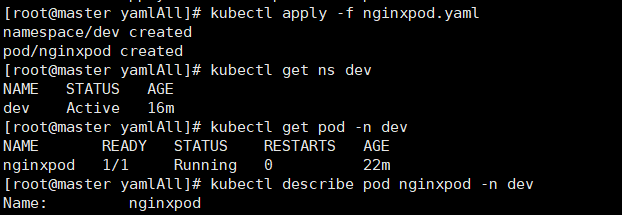
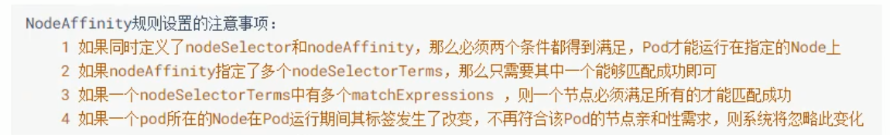
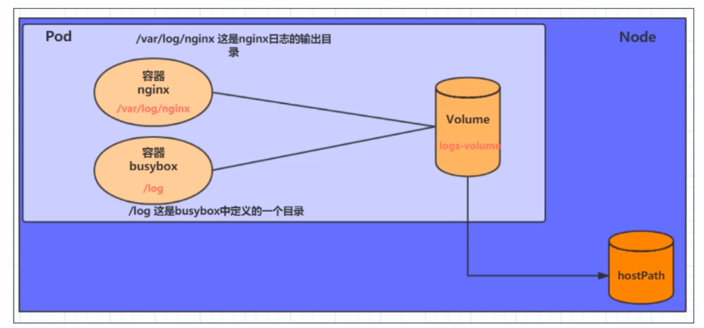
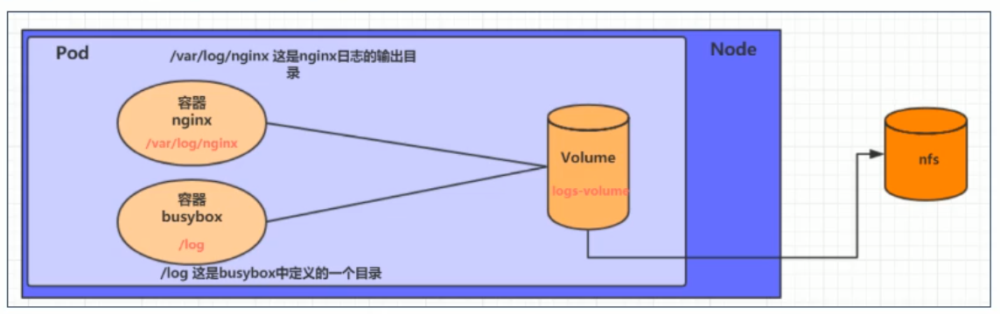
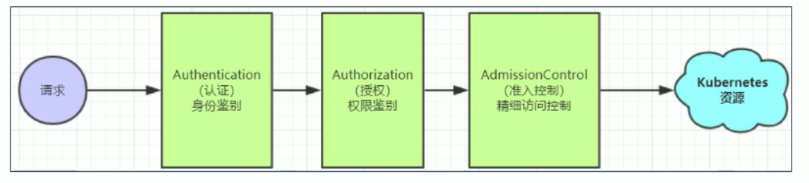

[TOC]

# 1 K8S简介

## 1.1 背景

### 1.1.1 服务类型

IAAS（基础设施服务）：阿里云

PAAS（平台级服务）：新浪云

SAAS（软件设施级服务）：office365

### 1.1.2 资源管理器

Apache MESOS

docker SWARM 功能太少 需要二次开发

Kubernetes 77%的市场占有率

### 1.1.3集群&分布式

集群：两个厨师烧一样的菜

分布式：一道菜分成切菜师、烧菜师、摆盘师来做

## 1.2 功能

自我修复：一旦崩溃 自己重启

弹性伸缩：可以对正在运行的容器进行调整

服务发现：自动发现它所依赖的服务

负载均衡：自动实现负载均衡

版本回退

存储编排：自动创建存储卷

## 1.3 组件

、


## 1.4 常见概念

Master: 集群的控制节点

Node: 工作节点（由Master分配容器到Node上）

Pod: K8S的最小控制单元，容器都是运行在Pod中的，1个Pod中可以有多个容器

Controller: 控制器，实现对Pod的管理（启动、停止、伸缩数量）

Service: Pod对外服务的统一入口，可维护同一类的多个Pod

Label: 对Pod进行分类，同一类Pod会拥有相同的标签

NameSpace: 命名空间，用来隔离Pod的运行环境


# 2 K8S安装

## 2.1环境初始化

***<u>绝对不能用小于2核2G的服务器 就算强制运行了也会报各种错误！！！！！！</u>***

### 2.1.1虚拟机安装


### 2.1.2 要求centos7.5及以上

```shell
cat /etc/redhat-release
```

### 2.1.3 主机名解析

```
vim /etc/hosts
```

```shell
# 添加以下内容 
 47.100.48.50 master
 47.100.40.199 node1
 47.101.175.54 node2
```

### 2.1.4 修改主机名

```shell
hostnamectl set-hostname xxxxx
```


### 2.1.5 时间同步

```shell
systemctl start chronyd  #启动
systemctl enable chronyd  #自启
date  #查看当前时间
```


### 2.1.6 禁用iptables和firewall服务

<!--生产环境中不关！开启如下端口-->
MASTER节点
6443* Kubernetes API server
2379-2380 etcd server client API
10250 Kubelet API
10251 kube-scheduler
10252 kube-controller-manager
10255 Read-only Kubelet API (Heapster)

Worker节点

10250 Kubelet API
10255 Read-only Kubelet API (Heapster)
30000-32767 Default port range for NodePort Services. Typically, these ports would need to be exposed to external load-balancers, or other external consumers of the application itself.

#### ubuntu

```shell
ufw status
systemctl stop ufw
systemctl disable ufw
```

#### centos

```shell
systemctl stop firewalld
systemctl stop iptables
systemctl disable firewalld
systemctl disable iptables
```

### 2.1.7 禁用selinux

```shell
vim /etc/selinux/config
SELINUX=disabled
```

### 2.1.8 禁用swap分区

```shell
vim /etc/fstab
# 注释掉swap所在行
```

### 2.1.9 修改linux内核参数

```shell
vim /etc/sysctl.d/kubernets.conf
```

```
net.bridge.bridge-nf-call-iptables  = 1
net.ipv4.ip_forward                 = 1
net.bridge.bridge-nf-call-ip6tables = 1
```

```shell
sysctl -p #重新加载参数
modprobe br_netfilter
lsmod | grep br_netfilter
```

### 2.1.10 配置ipvs功能

K8S中有两种代理模式iptables&ipvs 选择ipvs

```shell
yum install ipset ipvsadm
```

```shell
cat <<EOF> /etc/sysconfig/modules/ipvs.modules
#!/bin/bash
modprobe --ip_vs
modprobe --ip_vs_rr
modprobe --ip_vs_wrr
modprobe --ip_vs_sh
modprobe --nf_conntrack_ipv4
EOF
```

```shell
chmod +x /etc/sysconfig/modules/ipvs.modules

/bin/bash /etc/sysconfig/modules/ipvs.modules

lsmod | grep -e ip_vs -e nf_conntrack_ipv4
```


## 2.2 Docker安装

确定版本对应关系，目前kubernetes1.21.2对应的时docker20.10.2

### docker

参见https://docs.docker.com/engine/install/

安装完后

```shell
vim /etc/docker/daemon.json
```

```json
{
  "exec-opts": ["native.cgroupdriver=systemd"],
  "log-driver": "json-file",
  "log-opts": {"max-size": "500m", "max-file": "3"}
}
```

```shell
systemctl restart docker
```


```shell
service docker start#启动docker
service docker stop#停止docker
service docker restart#重启docker

systemctl enable docker
```


### docker-compose

参见https://docs.docker.com/compose/install/


## 2.3 安装

### 官方安装

https://kubernetes.io/zh/docs/setup/production-environment/tools/kubeadm/install-kubeadm/

### Ubuntu apt-get安装

https://zhuanlan.zhihu.com/p/138554103

```shell
apt-get update && apt-get install -y apt-transport-https
curl https://mirrors.aliyun.com/kubernetes/apt/doc/apt-key.gpg | apt-key add -
cat <<EOF >/etc/apt/sources.list.d/kubernetes.list
deb https://mirrors.aliyun.com/kubernetes/apt/ kubernetes-xenial main
EOF 
apt-get update
apt-get install -y kubelet kubeadm kubectl
```

### Centos yum安装

https://www.bilibili.com/video/BV1Qv41167ck?p=8 参见评论


```shell
cat <<EOF > /etc/yum.repos.d/kubernetes.repo
[kubernetes]
name=Kubernetes
baseurl=https://mirrors.aliyun.com/kubernetes/yum/repos/kubernetes-el7-x86_64/
enabled=1
gpgcheck=1
repo_gpgcheck=1
gpgkey=https://mirrors.aliyun.com/kubernetes/yum/doc/yum-key.gpg https://mirrors.aliyun.com/kubernetes/yum/doc/rpm-package-key.gpg
EOF
setenforce 0
yum install -y kubelet kubeadm kubectl
systemctl enable kubelet && systemctl start kubelet
```


## 2.4 初始化

### 2.4.1 镜像初始化

先看自己的版本 然后填到下面的images中

```shell
kubeadm config images list
```

```shell
images=( #下面的镜像应该去除"k8s.gcr.io/"的前缀，版本换成上面获取到的版本*
  kube-apiserver:v1.21.2
  kube-controller-manager:v1.21.2
  kube-scheduler:v1.21.2
  kube-proxy:v1.21.2
  pause:3.4.1
  etcd:3.4.13-0
  coredns:1.8.0
)

for imageName in ${images[@]} ; do
  docker pull registry.cn-hangzhou.aliyuncs.com/google_containers/$imageName
  docker tag registry.cn-hangzhou.aliyuncs.com/google_containers/$imageName k8s.gcr.io/$imageName
  docker rmi registry.cn-hangzhou.aliyuncs.com/google_containers/$imageName
done
```

 如果有问题 则执行

```shell
docker pull registry.cn-hangzhou.aliyuncs.com/google_containers/coredns:1.8.0
docker tag registry.cn-hangzhou.aliyuncs.com/google_containers/coredns:1.8.0 k8s.gcr.io/coredns/coredns:v1.8.0
docker rmi registry.cn-hangzhou.aliyuncs.com/google_containers/coredns:1.8.0

```


### 2.4.2 master初始化

***<u>绝对不能用小于2核2G的服务器 就算强制运行了也会报各种错误！！！！！！</u>***

版本号

pod网络

service网络

master节点的ip地址

~~忽略cpu数量~~ 不能忽略！！！

--v=5可以看更详细的日志

```shell
kubeadm init \
--kubernetes-version=v1.21.2 \
--pod-network-cidr=10.244.0.0/16 \
--service-cidr=10.96.0.0/12 \
--apiserver-advertise-address=47.100.48.50
# --ignore-preflight-errors=NumCPU
```

弹出以下代码则视为成功

照做


```shell
mkdir -p $HOME/.kube
sudo cp -i /etc/kubernetes/admin.conf $HOME/.kube/config
sudo chown $(id -u):$(id -g) $HOME/.kube/config

kubectl get nodes
# 查看所有的node


```

#### if failed

如果失败，则运行下面命令卸载k8s服务后重新安装

```shell
kubeadm reset
```

查看kubelet的运行状态和日志

```shell
systemctl status kubelet
journalctl -xeu kubelet
```


### 2.4.3 node加入集群

node1和node2 执行 上述init后成功的代码里的join


```shell
kubeadm join 192.168.189.100:6443 --token bx5ugx.ed5x0e4brmo54men \
	--discovery-token-ca-cert-hash sha256:afd00676234cfb1059e09417f58bcedb31968e7e8ff973979321eb0e9c6c5df7 
```


### 2.4.4 网络插件的安装

支持多种网络插件：flannel、calico、canal

只需在master节点执行即可，插件使用的时DaemonSet控制器，它会在每个节点上都运行

```shell
wget https://raw.githubusercontent.com/coreos/flannel/master/Documentation/kube-flannel.yml

# 修改quay.io仓库为quay.mirrors.ustc.edu.cn

kubectl apply -f kube-flannel.yml
```


有多处需要替换


运行如下命令查看status是否ready，如果ready，则代表网络插件安装成功

```
kubectl get nodes
```


#### if failed

采取如下命令查看镜像是否能访问

```
kubectl get pod -n kube-system
```

如果


则说明镜像失效，需要更换镜像

如下为镜像正常的状态


## 2.5 环境测试

在k8s中部署nginx程序作测试，检测集群是否在正常工作

只需要在**master节点**里操作就可以了


```shell
# 部署nginx 名字为nginx 采取nginx:latest镜像
kubectl create deployment nginx --image=nginx:latest
# 暴露端口 把80端口随机暴露出去
kubectl expose deployment nginx --port=80 --type=NodePort
# 查看pod
kubectl get pod
# 查看服务状态
kubectl get service

```


看nginx对应的端口是多少

图里为30830

所以访问

http://192.168.189.100:30830/

http://192.168.189.101:30830/

http://192.168.189.102:30830/

都是一样的


成功


# 3 资源管理

## 3.1 资源管理介绍

在kubernetes中，所有的内容都抽象为资源，用户需要通过操作资源来管理kubernetes


kubernetes本质上是一个集群系统

可以在kubernetes中部署各种服务

即在kubernetes中运行一个一个容器


kubernetes的最小管理单元是pod不是容器

只能将容器放到pod中

kubernetes通过controller-manager来管理pod，而非直接管理


pod提供服务之后，通过service资源访问pod中的服务

pod通过etcd进行存储持久化


## 3.2 yaml语言

类似xml、json，以**数据**为中心，不是以标识语言为中心，更简单


### xml

```xml
<hentai8>
	<age>15</age>
    <address>BeiJing</address>
</hentai8>
```


### yaml

```yaml
hentai7:
	age: 15
	address: Earth
```

p.s. 

​	大小写敏感

​	**冒号后必须加空格**

​	缩进表示层级关系（必须左对齐，几个空格符无所谓）

​	不允许tab 只允许空格（低版本限制）

​	‘#’ 表示注释

​	多段yaml配置放在一个文件中，用 --- 分隔


支持的数据类型：

​	纯量：单个、不可再分（字符串、bool、整数、浮点数、null、时间、日期）

​	对象：键值对的集合（映射（mapping）、哈希（hash）、字典（dictionary））

​	数组：一组按次序排列的值（序列（sequence）、列表（list）） **加 -**

```yaml
c1: false
c2: 234
c3: 123.123
# 表示null
c4: ~
# 日期使用ISO 8601格式 yyyy-MM-dd
c5: 2018-02-17
c6: 'wo shi miao'
c7: 'wo shi'
	'miao miao miao'
```


```yaml
hentai8:
  age: 18
  address: Mars
```


```yaml
hentai8:
  age: 18
  address: Mars
  attribute:
    - lazy
    - proud
    - procrastination
```


json转yaml

http://www.json2yaml.com/


## 3.3 资源管理方式


命令式对象管理：直接用命令去操作kubernetes资源

```shell
kubectl run nginx-pod --images=nginx:latest --port=80
```


命令式对象配置：通过命令配置和配置文件去操作kubernetes资源

```shell
kubectl create/patch -f nginx-pod.yaml
```


声明式对象配置：通过apply命令和配置文件去操作kubernetes资源

```shell
kubectl apply -f nginx-pod.yaml
# apply 仅用于创建和更新资源，如果没有就创建 如果有就更新
```


### 3.3.1 命令式对象管理

**kubectl命令**


```shell
kubectl [command] [type] [name] [flags]
```


command: 指定对资源执行的操作 create get delete

type: 指定资源类型 deployment pod service

name: 指定资源的名称 大小写敏感

flags: 指定参数 `kubelet get pod -o wide`  `kubelet get pod -o json` 详细信息


#### command命令


#### type 资源类型


可以通过 `kubectl api-resources` 查看


#### example

以namespace、pod的创建和删除为例

```shell
# 创建名为dev的namespace
kubectl create namespace dev
# 获取所有的namespace
kubectl get ns
# 在名为dev的namespace下创建并运行一个nginx的Pod
kubectl run pod --image=nginx -n dev
# 查看在dev下新创建的Pod
kubectl get pods -n dev
# 查看创建的pod的详细信息
kubectl describe pods pod -n dev
# 删除指定的pod（一定要加namespace 不然找不到）
kubectl delete pods pod -n dev
# 删除指定的namespace
kubectl delete namespace dev
```


先调度 分配给node1去干活

然后拉取nginx镜像

然后创建容器

再启动容器


### 3.3.2 命令式对象配置

命令配合配置文件一起操作k8s资源

1）创建一个nginxpod.yaml


```yaml
apiVersion: v1
kind: Namespace
metadata: 
  name: dev
  
---

apiVersion: v1
kind: Pod
metadata: 
  name: nginxpod
  namespace: dev
spec: 
  containers: 
  - name: nginx-containers
    image: nginx
```


```shell
# 创建资源 创建了名为dev的namespace和名为nginxpod的pod
kubectl create -f nginxpod.yaml

# 查看资源的信息
kubectl get -f nginxpod.yaml

# 删除资源
kubectl delete -f nginxpod.yaml
```


### 3.3.3 声明式对象配置

和命令式对象配置类似，但只有一个apply命令（创建&更新，相当于create和patch）

```shell
kubectl apply -f nginxpod.yaml
```





### 3.3.4 if 在node节点上kubectl

需要进行额外配置

配置文件为$HOME/.kube

需要将master上的.kube文件复制到node节点上

即在master上执行


```shell
scp -r $HOME/.kube node1: $HOME/
```

默认为

```shell
scp -r ~/.kube node1:~/
```


# 4 组件

## 4.1 Namespace

功能：实现**多套环境的资源隔离**或者**多租户的资源隔离**


默认所有pod时可以相互访问的，实际生产中，将pod分成不同的namespace 在同一个组中的可以相互访问 不同组中的不能相互访问


通过k8s的授权机制，将不同的namespace将给不同租户进行管理，实现多租户的资源隔离。结合k8s的资源配额机制，限定不同租户能占用的资源，例如CPU、内存等，实现租户可用资源的管理。


kubernetes启动后会默认创建几个namespace


default: 所有未指定namespace的对象都会被分配在default命名空间

kube-node-lease: 集群节点之间的心跳维护

kube-public: 此命名空间下的资源可以被所有人访问（包括未认证用户）

kube-system: 所有由kubernetes系统创建的资源都处在这个命名空间中


ResourceQuota 针对namespace做的资源限制

LimitRange针对namespace中的每个组件做的资源限制

### 命令行

```shell
kubectl create ns dev
kubectl get ns
kubectl delete ns dev
```


### 配置方式

准备一个yaml稳健：ns-dev.yaml

```yaml
apiVersion: v1
kind: Namespace
metadata: 
  name: dev
```

然后执行对应的创建和删除命令

```shell
kubectl create/apply -f ns-dev.yaml
kubectl delete -f ns-dev.yaml
```


## 4.2 Pod

pod是kubernetes集群进行管理的最小单元

程序运行在容器内，容器存在于pod内

pod是容器的封装，可存一个或者多个容器


集群中的各个系统组件也是以pod方式运行的

```shell
kubectl get pod -n kube-system
```


### 创建并运行

kubernetes没有提供单独运行pod的命令，都是通过pod控制器来实现的

```shell
kubectl run nginx --image=nginx --port=80 --namesapce=dev
```


### 查看pod信息

```shell
kubectl get pods -n dev
kubectl describe pod xxxxx -n dev
```


### 删除指定pod

如果删除了后会自动新建
说明当前pod是由pod控制器创建的
pod控制器会监控pod状态 一旦发现pod死亡 会立即重建
如果想要删除pod 必须删除pod控制器（deployment）

```shell
kubectl delete pod xxxx -n dev

kubectl get pod -n dev
# 如果删除了后会自动新建
# 说明当前pod是由pod控制器创建的
# pod控制器会监控pod状态 一旦发现pod死亡 会立即重建
# 如果想要删除pod 必须删除pod控制器


#
kubectl get deployment -n dev

kubectl delete deployment xxxx -n dev
```


### 配置操作


新建pod-nginx.yaml

```yaml
apiVersion: v1
kind: pod
metadata: 
  name: nginx
  namespace: dev
spec: 
  containers:
  - image: nginx
    imagePullPolicy: IfNotPresent
    name: pod
    ports:
    - name: nginx-port
      containerPort: 80
      protocol: TCP
```


```shell
kubectl create -f pod-nginx.yaml

kubectl delete -f pod-nginx.yaml
```


## 4.3Label

### 功能

label的作用是在资源上添加标识

用来对资源进行区分和选择


### 特点

一个label会以key/value键值对的形式附加到各种对象上，比如node、pod、service等等

一个资源对象可以定义任意数量的label，同一个label也可以被添加到任意数量的资源对象上去

label通常在资源对象定义时确定，当然也可以在对象创建后动态添加或者删除


可以通过label实现资源的多维度分组，实现灵活、方便地进行资源分配、调度、配置、部署等管理工作

### 常见label示例

版本：version:3.0	version:stable

环境：environment:dev	environment:test

架构：tier:frontend	tier:backend


### Label Selector

用于查询和筛选拥有某些标签的资源对象

有两种Label Selector

多个一起使用，用“，”进行分隔

#### 基于等式的Label Selector

name=slave

env!=production 选择有env标签 并且不等于production 的

#### 基于集合的Label Selector

name in (master, slave)

name not in (frontened) 选择有name标签 并且不等于frontened的


### 打标签

#### 命令方式


```shell

# 查看label
kubectl get pod -n dev --show-labels
# 打label
kubectl label pod nginx-55649fd747-rr27z -n dev version=1.0
# 更新标签
kubectl label pod nginx-55649fd747-rr27z -n dev version=2.0 --overwrite
# 删除标签
kubectl label pod nginx-55649fd747-rr27z -n dev version-

# 筛选标签
kubectl get pod -n dev -l version=2.0 --show-labels
kubectl get pod -n dev -l version!=2.0 --show-labels
```


#### 配置方式

新建pod-nginx.yaml


```yaml
apiVersion: v1
kind: Pod
metadata: 
  name: nginx
  namespace: dev
  labels: 
    version: "1.0"
    env: "test"
spec: 
  containers:
  - image: nginx
    name: pod
    ports:
    - name: nginx-port
      conatinerPort: 80
      protocol: TCP
```


```shell
kubectl apply -f pod-nginx.yaml
```


## 4.4 Deployment

pod控制器

k8s很少直接控制pod

一般通过pod控制器来完成

pod控制器用于pod的管理

确保pod资源符合预期的状态

当pod资源出现故障时，会尝试进行重启或者重建pod


pod控制器有很多，主要介绍deployment


### 命令操作

**--replicas 被弃用**

```shell
# 创建 --replicas 指定数量
kubectl run nginx --image=nginx --port=80 --replicas=3 -n dev

# 查看创建的pod
kubectl get pods -n dev

# 查看development信息
kubectl get deploy xxx -n dev
kubectl describe deploy xxx -n dev


# 删除
kubectl delete deploy xxx -n dev
```


### 配置操作

新建一个deploy-nginx.yaml

template开始是pod模板

通过标签和选择器连接起来

```yaml
  selector:
    matchLables:
      run: nginx
```


```yaml
  labels:
    run: nginx
```


完整文件

```yaml
apiVersion: apps/v1
kind: Deployment
metadata:
  name: nginx
  namespace: dev
spec:
  replicas: 3
  selector:
    matchLabels:
      run: nginx
  template:
    metadata:
      labels:
        run: nginx
    spec:
      containers:
      - image: nginx
        name: nginx
        ports:
        - containerPort: 80
          protocol: TCP
```


kubectl create -f deploy-nginx.yaml

kubectl get deployment -n dev

kubectl delete -f deploy-nginx.yaml


## 4.5 Service

原理详解

https://zhuanlan.zhihu.com/p/111244353


每个pod都会分配一个单独的pod ip，但会存在以下两个问题:

​	pod ip和name会随着pod的重建产生变化

​	pod ip是集群内可见的虚拟ip,外部无法访问


service可以看作是一组同类pod对外的访问接口

service的ip在整个生命周期内都是不会变化的

借助service,可以方便地实现服务发现和负载均衡


### 创建集群内可访问的service

将service和deployment进行绑定

```shell
# 暴露service
kubectl expose deploy nginx --name=svc-nginx3 --type=ClusterIP --port=80 --target-port=80 -n dev
# 查看service
kubectl get service -n dev
kubernetes   ClusterIP   10.96.0.1        <none>        443/TCP        4d23h
nginx        NodePort    10.100.84.146    <none>        80:30830/TCP   4d22h
svc-nginx3   ClusterIP   10.100.208.171   <none>        80/TCP         36s
# 查看是否能访问
curl 10.100.208.171:80


```


### 创建集群内外都可访问的service

将service和deployment进行绑定

type更改为NodePort

```shell
# 暴露service
kubectl expose deploy nginx --name=svc-nginx3 --type=NodePort --port=80 --target-port=80 -n dev
# 查看service 出现有一组对应的port
kubectl get service -n dev
# 删除
kubectl delete svc svc-nginx3 -n dev
```


然后外网直接访问对应端口即可

http://192.168.189.100:31459/


### 配置方式

新建svc-nginx.yaml


```yaml
apiVersion: v1
kind: Service
metadata: 
  name: svc-nginx
  namespace: dev
spec:
  clusterIP: 10.109.179.231
  ports:
  - port: 80
    portocol: TCP
    targetPort: 80
  selector:
    run: nginx
  type: ClusterIP
```


```shell
kubectl create -f svc-nginx.yaml
kubectl delete -f svc-nginx.yaml
```


# 5 Pod详解

yaml原理


## 5.1 Pod详细介绍

### 5.1.1 pod结构


每个pod可以包含一个或者多个容器

pod中的容器可以分为2类:

​	用户程序所在的容器,数量可多可少

​	Pause容器——每个pod都会有的一个根容器

​		功能：

​				可以以它为一句，评估整个pod的健康状态

​				可以在根容器上设置ip地址，该pod内的其他容器都用此ip，实现pod内部的网络通讯

**p.s.** pod之间的通讯采取虚拟二层网络技术实现，比如flannel之类的


### Pod定义


pod的资源清单

```shell
kubectl explain pod
kubectl explain pod.metadata
kubectl explain pod.metadata.managedFields

# apiversion
kubectl api-versions
# kind
kubectl api-resouerces
# metadata 元数据
kubectl explain pod.metadata
# spec 详细定义
kubectl explain pod.spec
# 状态 不需要定义 由k8s自动生成
kubectl explain pod.status
```


```yaml
apiVersion: v1			 #必选,版本号,例如v1
kind: Pod				#必选,资源类型,例如 Pod
metadata:				#必选,元数据
  name : string			 #必选,Pod名称
  namespace: string 		#Pod所属的命名空间，默认为" default"labels:
  labels:					#自定义标签列表
    - namd: string
spec:						#必选,Pod中容器的详细定义 
  containers: 				#必选,Pod中容器列表
  - name: string			#必选,容器名称
    image: string			#必选,容器的镜像名称
    imagePullPolicy: [ Always | Never |IfNotPresent ]		#获取镜像的策略
	command: [string] 				#容器的启动命令列表,如不指定，使用打包时使用的启动命令
    args: [string]					#容器的启动命令参数列表
    workingDir: string			     #容器的工作目录
    volumeMounts:					#挂载到容器内部的存储卷配置
	- name: string					#好用pod定义的共享存储卷的名称,需用volumes[ ]部分定义的的卷名
	  mountPath: string				#存储卷在容器内mount的绝对路径，应少于512字符
	  readonly: boolean				#是否为只读模式
    ports:						#需要暴露的端口库号列表
    - name: string				#端口的名称
	  containerPort: int		 #容器需要监听的端口号
	  hostPort: int					#容器所在主机需要监听的端口号,默认与Container相同
	  protocol: string				#端口协议,支持TCP和UDP,默认TCP 
	env:						#容器运行前需设置的环境变量列表
	- name: string				 #环境变量名称
 	  value: string				 #环境变量的值
 	resources:					 #资源限制和请求的设置
 	  limits:						#资源限制的设置
	  	cpu: string					#cpu的限制,单位为core数,将用于docker run --cpu-shares参数
		memory: string				#内存限制，单位可以为Mib/Gib,将用于docker run --memory参数
	  requests:						#资源请求的设置
	    cpu: string					#cpu请求,容器启动的初始可用数量
	    memory: string 				#内存请求，容器启动的初始可用数量
    lifecycle:						#生命周期钩子
	  postStart: 					#容器启动后立即执行此钩子,如果执行失败,会根据重启策略进行重启
	  preStop: 						#溶容器终止前执行此钩子,无论结果如何，容器都会终止
	livenessProbe: 					#对Pod内各容哭健唐检查的设署，当探测无响应几次后将自动重启该容器
	  exec:							#Pod容器内检查方式设置为exec方式
	    command: [string] 				#exec方式需要制定的命令或脚本
	    httpGet:							#对Pod某个容器健康检查方法设置为HttpGet，需要制定Path、port
		  path: string
		  port: number
		  host: string
		  scheme: string
		  HttpHeaders:
		  - name : string
			value: string
		tcpSocket: 							#对Pod内个容器健康检查方式设置为tcpSocket方式
		  port: number
		initialDelaySeconds: 0					#容器启动完成后首次探测的时间,单位为秒
		timeoutSeconds: 0						#对容器健康检查探测等待响应的超时时间，单位秒,默认1秒
		periodSeconds: 0						#对容器监控检查的定期探测时间设置,单位秒，黑认18秒一次
		successThreshold: 0
		failureThreshold: 0
		securityContext:
		  privileged: false
	restartPolicy: [Always  Never| OnFailure] 					#Pod的重启策略
	nodeName: <string>									#设置NodeName表示将该Pod调度到指定到名称的node节点上
	nodeSelector: obeject 							#设置NodeSelector表示将该Pod调度到包含这个label的node节点上
	imagePullSecrets:							#Pull镜像时使用的secret名称，以key: secretkey格式指定
	- name: string
     hostNetwork: false					#是否使用主机网络模式，默认为false,如果设置为true,表示使用宿主机网络
     volumes: 								#在该pod上定义共享存储卷列表
	 - name: string							#共享存储卷名称（volumes类型有很多种)
	 emptyDir: {}									#类型为emtyDir的存储卷,与Pod同生命周期的一个临时目录,为空值
	 hostPath: string						#类型为hostPath的存储卷,表示挂载Pod所在宿主机的目录
	   path: string						#Pod所在宿主机的目录,将被用于同期中mount的目录
	 secret:							#类型为secret的存储卷,挂载集群与定义的secret对象到容器内部
	   scretname: string
	   items :
	   - key : string
	     path: string
	   configMap:						#类型为configMap的存储卷，挂载预定义的configMap对象到容器内部
	     name: string
	     items:
	     - key: string
	       path: string
```


## 5.2 Pod配置

pod.sepc.containers属性

```shell
kubectl explain pod.sepc.containers
```


### 5.2.1 基本配置

创建pod-base.yaml文件，内容如下

```yaml
apiVersion: v1
kind: Pod
metadata: 
  name: pod-base
  namespace: dev
  labels:
    user: hentai8
spec: 
  containers:
  - name: nginx
    image: nginx
  - name: busybox
    image: busybox

```

定义了两个容器，nginx和busybox

然后

```shell
kubectl apply -f pod-base.yaml
```


### 5.2.2 镜像拉取

imgaePullPolicy属性

三种镜像拉取策略：

​	Always: 总是从远程仓库拉取

​	IfNotPresent: 由本地就用本地 没有就远程

​	Never: 只用本地的 没有就报错


**p.s.** 

​	**如果镜像tag为具体版本号 默认为IfNotPresent**

​	**如果tag为latest 默认为Always**

​	**运行时需要拉取镜像到工作节点上 而不是master节点上**

​	**如果使用never，一定要工作节点上有对应的镜像**


创建pod-imagepullpolicy.yaml文件，内容如下

```yaml
apiVersion: v1
kind: Pod
metadata: 
  name: pod-imagepullpolicy
  namespace: dev
  labels:
    user: hentai8
spec: 
  containers:
  - name: nginx
    image: nginx:1.17.1
    imagePullPolicy: Never
  - name: busybox
    image: busybox:1.30
```


### 5.2.3 启动命令

**command&args**

在上面开不启busybox容器是因为busybox不是一个程序，是一个工具类的集合

由k8s启动后，会自动关闭

想要让其一直运行 需要用到command配置


创建pod-command.yaml文件，内容如下


```yaml
apiVersion: v1
kind: Pod
metadata: 
  name: pod-command
  namespace: dev
  labels:
    user: hentai8
spec: 
  containers:
  - name: nginx
    image: nginx:1.17.1
  - name: busybox
    image: busybox:1.30
    command: ["/bin/sh", "-c", "touch /tmp/hello.txt;while true;do /bin/echo $(date +%T) >> /tmp/hello.txt; sleep 3; done;"]
```


command——用于在pod中的容器初始化完毕之后运行的命令


#### 进入容器操作

```shell
kubectl exec pod名称 -n 命名空间 -it -c 容器名称 /bin/bash 在容器内执行的命令
kubectl exec pod-command -n dev -it -c busybox /bin/bash
# 然后就可以直接输入命令
```


**command就是替代docker中的entrypoint**

**agrs是跟在docker中的entrypoint后面的参数**


### 5.2.4 环境变量

创建pod-env.yaml

```yaml
apiVersion: v1
kind: Pod
metadata: 
  name: pod-env
  namespace: dev
  labels:
    user: hentai8
spec: 
  containers:
  - name: busybox
    image: busybox:1.30
    command: ["/bin/sh", "-c", "touch /tmp/hello.txt;while true;do /bin/echo $(date +%T) >> /tmp/hello.txt; sleep 60; done;"]
    env: 
    - name: "username"
      value: "admin"
    - name: "password"
      value: "123456"
```


运行后输入

```shell
kubectl apply -f pod-env.yaml

kubectl exec pod-env -n dev -c busybox -it /bin/bash
echo $username
echo $password
```


看是否输出


### 5.2.5  端口设置


hostPort如果设置，只能映射一个pod中的一个容器的一个端口到主机的对应端口上，同一个service下的服务的端口无法映射到主机的对应端口


创建pod-ports.yaml

```yaml
apiVersion: v1
kind: Pod
metadata: 
  name: pod-command
  namespace: dev
  labels:
    user: hentai8
spec: 
  containers:
  - name: nginx
    image: nginx:1.17.1
    ports: 
    - name: nginx-port
      containerPort: 80
      portocol: TCP
```


### 5.2.6 资源配额

通过resources选项实现，有两个子选项：

​	limit：用于限制运行时的最大占用资源，当容器占用超过limit时会被终止，并进行重启

​	request：用于设置容器需要的最小资源，如果环境资源不够，容器将无法启动

通过上面两个选项设置资源的上下限


创建pod-resources.yaml

```yaml
apiVersion: v1
kind: Pod
metadata:
  name: pod-resources
  namespace: dev
spec:
  containers:
    - name: nginx
      image: nginx
      resources: # 资源配额
      	limits: # 限制资源（上限）
      	  cpu: "2" # cpu限制
      	  memory: "10Gi" # 内存限制
        requests: # 请求资源（下限）
          cpu: "1" # cpu限制
          memory: "10Mi" # 内存限制
```


运行

```shell
kubectl create -f pod-resources.yaml
```


## 5.3 生命周期

生命周期包括：

​	pod的创建过程

​	运行初始化容器过程（init container）

​	运行主容器过程（main container）

​		容器启动后钩子（post start）、容器终止前狗子（pre stop）

​		容器的存活性探测（liveness probe）、就绪性探测（readiness probe）

​	pod终止过程


整个生命周期中，pod回出现5种状态（相位），分别如下

​	挂起（pending）：apiserver已经创建了pod资源对象，但他尚未被调度完成或者仍处于下载镜像的过程中

​	运行中（running）：pod已经被调度至某节点，并且所有容器都已经被kubelet创建完成

​	成功（succeeded）：pod中的所有容器都已经成功运行后终止并且不会被重启

​	失败（failed）：所有容器都已经中指，但至少有一个容器终止失败，即容器返回了非0值的退出状态

​	未知（unknown）：apiserver无法正常获取到pod对象的状态信息，通常由网络通信失败所导致


### 5.3.1 创建和终止

pod的**创建过程**：

​	1、用户通过kubectl或者其他api客户端提交需要创建的pod信息给apiServer

​	2、apiServer开始生成pod对象信息，并将信息存入etcd中，然后返回确认信息至客户端

​	3、apiServer开始反映etcd中的pod对象的变化，其他组件实用watch机制来跟踪检查apiServer上的变动

​	4、scheduler发现有新的pod对象要创建，开始为pod分配主机并将结果信息更新至apiServer

​	5、node节点上的kubelet发现有pod调度过来，尝试调用docker启动容器，并将结果回送至api

​	6、apiServer将接收到的pod状态信息存入etcd中


pod的**终止过程**：


### 5.3.2 初始化容器

 初始化容器是在pod的主容器启动前要运行的容器，主要是做一些主容器的前置工作


 初始化容器具有两大特征：

- 初始化容器必须运行完成直至结束，若某初始化容器运行失败，那么kubernets需要重启他知道成功完成为止
- 初始化容器必须按照定义的顺序执行，当且仅当前一个成功之后，后面的一个才能运行


初始化容器有很多应用场景，比如：

- 提供主容器镜像中不具备的工具程序或自定义代码
- 初始化容器要先于应用容器串行启动并运行，因此可用于延后应用容器的启动直至其依赖的条件得到满足


例如：

假设要以主容器来运行nginx，但是要求再运行nginx之前先要能够连接上mysql和redis所在服务器

为了简化测试，事先规定好mysql（）和redis（）的服务器地址


创建pod-initcointainer.yaml，内容如下：

```yaml
apiVersion: v1
kind: pod
metadata:
  name: pod-initcointainer
  namespace: dev
spec:
  cointainers:
  - name: main-container
    image: nginx
    ports: 
    - name: nginx-port
      containerPort: 80
  initContainers: 
  - name: test-mysql
    image: busybox:1.30
    command: ['sh', '-c', 'until ping 192.168.109.201 -c 1 ; do echo waiting for mysql...; sleep 2 ; done;']
  - name: test-redis
    image: busybox:1.30
    command: ['sh', '-c', 'until ping 192.168.109.202 -c 1 ; do echo waiting for redis...; sleep 2 ; done;']
        

```


创建pod

```shell
kubectl create -f pod-initcointainer.yaml


# 动态查看服务器状态
kubectl get pods pod-initcointainer -n dev -w 


# 新开一个shell，为当前服务器新增两个ip，观察pod的变化
#ifconfig ens33:1 192.168.109.201 network 255.255.255.0 up
#ifconfig ens33:2 192.168.109.202 network 255.255.255.0 up
```


### 5.3.3 钩子函数


kubernetes 提供了两个钩子函数：

- post start：容器创建之后执行，如果失败了会重启容器
- pre stop：容器终止之前执行，执行完成之后容器将成功终止，再其完成之前会阻塞删除容器的操作


钩子处理器支持实用下面三种方式定义动作：

- Exec命令：在容器内执行一次命令

```yaml
lifecycle:
  postStart: 
    exec: 
      command: 
      - cat
      - /tmp/healthy
```


- TCPSocket：在当前容器尝试访问指定的socket

```yaml
lifecycle:
  postStart: 
    exec: 
      tcpSocket: 
        port: 8080
```


- HTTPGet：在当前容器中向某url发起http请求

组合起来就是http://192.168.109.100:80/

```yaml
lifecycle:
  postStart: 
    exec: 
      httpSocket: 
        path: / # url 地址
        port: 80 # 端口号
        host: 192.168.109.100 # 主机地址
        scheme: HTTP # 支持的协议，http或者https
```


### 5.3.4 容器探测

容器探测用于检测容器中的应用示例是否正常工作，是保障业务可用性的一种传统机制。如果经过探测，实例不符合预期，那么kubernetes就会把该问题实例”摘除“，不承担业务流量。

kubernetes提供了两种探针来实现容器探测，分别是：

- **liveness probes**（决定是否重启）：存活性探针，用于检测应用实例当前**是否处于正常运行状态**，如果不是，k8s会重启容器
- **readiness probes**（决定是否将请求转发给该pod）：就绪性探针，看**是否准备好**，用于检测应用实例当前是否可以接受请求，如果不能，k8s不会转发流量


上面两种探针支持三种探测方法：

- Exec命令：在容器内执行一次命令

```yaml
lifecycle:
  postStart: 
    exec: 
      command: 
      - cat
      - /tmp/healthy
```


- TCPSocket：在当前容器尝试访问指定的socket

```yaml
lifecycle:
  tcpSocket: 
    port: 8080
```


- HTTPGet：在当前容器中向某url发起http请求

组合起来就是http://192.168.109.100:80/

```yaml
lifecycle:
  httpSocket: 
    path: / # url 地址
    port: 80 # 端口号
    host: 192.168.109.100 # 主机地址
    scheme: HTTP # 支持的协议，http或者https
```


3个例子：

**Exec**：

创建pod-liveness-exec.yaml

```yaml
apiVersion: v1
kind: Pod
metadata:
  name: pod-liveness-exec
  namespace: dev
spec:
  containers:
  - name: nginx
    image: nginx
    ports: 
    - name: nginx-port
      containerPort: 80
    livenessProbe: 
      exec: 
        command: ["/bin/bash", "/tmp/hello.txt"]
```


创建pod，观察pod，一直在重启

```shell
kubectl create -f pod-liveness-exec.yaml
kubectl describe pods pod-liveness-exec -n dev
```


方法二：TCPSocket

创建pod-liveness-tcpsocket.yaml

```yaml
apiVersion: v1
kind: Pod
metadata:
  name: pod-liveness-tcpsocket
  namespace: dev
spec:
  containers:
  - name: nginx
    image: nginx
    ports: 
    - name: nginx-port
      containerPort: 80
  	livenessProbe:
      tcpSocket: 
        port: 8080
```


方法三：HTTPGet

创建pod-liveness-httpget.yaml


```yaml
apiVersion: v1
kind: Pod
metadata:
  name: pod-liveness-httpget
  namespace: dev
spec:
  containers:
  - name: nginx
    image: nginx
    ports: 
    - name: nginx-port
      containerPort: 80
    livenessProbe:
      httpGet: 
        path: / # url 地址
        port: 80 # 端口号
        host: 127.0.0.1 # 主机地址
        scheme: HTTP # 支持的协议，http或者https
```


额外设置


```yaml
initialDelaySeconds	# 容器启动后等待多少秒执行第一次探测
timeoutSeconds		# 探测超时时间，默认1s
periodSeconds		# 执行探测的频率，默认10s
failureThreshold	# 连续探测失败多少次才被认定为失败。默认是3，最小值是1
successThreshold	# 连续探测成功多少次才被认定为成功，默认是1
```


### 5.3.5 重启策略

重启策略有三种：

Always:容器失效时，自动重启该容器（默认）

OnFailure:容器终止运行且退出码不为0时重启

Never:不论状态为何，都不重启该容器


反复重启操作的延迟时间为10s	20s	40s	80s	160s	300s

300s时最大延迟时长


创建pod-restartpolicy.yaml

```yaml
apiVersion: v1
kind: Pod
metadata:
  name: pod-liveness-httpget
  namespace: dev
spec:
  containers:
  - name: nginx
    image: nginx
    ports: 
    - name: nginx-port
      containerPort: 80
    lifecycle:
      httpSocket: 
        path: /hello # url 地址
        port: 80 # 端口号
        scheme: HTTP # 支持的协议，http或者https
  restartPolicy: Never
```


## 5.4 Pod调度


四大类调度方式：

- 自动调度：运行在哪个节点上完全由Scheduler经过一系列的算法计算得出
- 定向调度：NodeName、NodeSelector
- 亲和性调度：NodeAffinity、PodAffinity、PodAntiAffinity
- 污点（容忍）调度：Taints、Toleration


### 5.4.1 定向调度

指定Node


**NodeName**


创建一个pod-nodename.yaml

```yaml
apiVersion: v1
kind: Pod
metadata:
  name: pod-nodename
  namespace: dev
spec:
  containers:
  - name:lethean
    image: hentai8/lethean:1.0
  nodeName: node1
```


**NodeSelector**


首先为node节点添加标签

```shell
kubectl label nodes node1 nodeenv=pro
kubectl label nodes node2 nodeenv=test
```


创建一个pod-nodeselector.yaml

```yaml
apiVersion: v1
kind: Pod
metadata:
  name: pod-nodeselector
  namespace: dev
spec:
  containers:
  - name: lethean
    image: hentai8/lethean:1.0
  nodeSelector:
    nodeenv: pro
```


### 5.4.2 亲和性调度


优先选择满足条件的node进行调度，如果没有，也可以调度到不满足条件的节点上，更加灵活


Affinity主要分为三类：

- **nodeAffinity**(node亲和性)：优先调到到哪些node
- **podAffinity**(pod亲和性)：优先和哪些pod部署在同一个拓扑域（如果两个应用频繁交互，应该让两个应用尽可能地靠近，减少因网络通信带来的性能损耗）
- **podAntiAffinity**(pod反亲和性)：优先不和哪些已存在的pod部署在同一个拓扑域中（比如说当应用采用多副本部署时，有必要采用反亲和性让各个应用实例打散分布在各个node上，这样可以提高服务的高可用性）


#### nodeAffinity


创建pod-nodeaffinity-required.yaml

```yaml
apiVersion: v1
kind: Pod
metadata:
  name: pod-nodeaffinity-required
  namespace: dev
spec:
  containers:
  - name: lethean
    image: hentai8/lethean:1.0
  affinity: # 亲和性设置
    nodeAffinity: # 设置node亲和性
      requireDuringSchedulingIgnoredDuringExecution: # 硬限制
       nodeSelectorTerms: 
       - matchExpressions: # 匹配env的值在["xxx", "yyy"]中的标签
         - key: nodeenv
           operator: In
           values: ["xxx", "yyy"]
```


创建pod-nodeaffinity-preferred.yaml

```yaml
apiVersion: v1
kind: Pod
metadata:
  name: pod-nodeaffinity-preferred
  namespace: dev
spec:
  containers:
  - name: lethean
    image: hentai8/lethean:1.0
  affinity: # 亲和性设置
    nodeAffinity: # 设置node亲和性
      preferredDuringSchedulingIgnoredDuringExecution: # 硬限制
      - weight: 1
       preference: 
       - matchExpressions: # 匹配env的值在["xxx", "yyy"]中的标签
         - key: nodeenv
           operator: In
           values: ["xxx", "yyy"]
```


**注意事项：**




### 5.4.3 污点和容忍


# 6 Pod控制器


## 6.1 Pod控制器介绍

pod按照创建方式可以分为两类：

- 自主式pod：k8s直接创建出来的pod，这种pod删除后就没有了，也不会重建
- 控制器创建的pod：通过控制器创建的pod，这种pod删除了之后还会自动重建


常见的pod控制器：


## 6.2 ReplicaSet

保证一定数量的pod能够正常运行，持续缉拿听这些pod的运行状态，一旦pod发生故障，就会重启和重建，支持pod数量的扩缩容和版本镜像的升级


```yaml
apiVersion: apps/v1
kind: ReplicaSet
metadata:
  name:			# 元数据
  namespace: 	# 所属命名空间
  labels: 		# 标签
    controller: rs
spec:
  replicas: 3	# 数量
  selector: 	# 选择器，通过它指定该控制器管理哪些pod
    matchLabels:
      app: nginx-pod
    matchExpressions: 
      - {key: app, operator: In, values: [nginx-pod]}
  template: 	# 模板，当副本数量不足时，会根据下面的模板创建pod副本
    metadata: 
      labels: 
        app: nginx-pod
    spec:
      containers: 
      - name: nginx
        image: nginx
        ports: 
        - containerPort: 80

```


**例子**：

创建pc-replicaset.yaml

```yaml
apiVersion: apps/v1
kind: ReplicaSet
metadata:
  name: pc-replicaset
  namespace: dev
spec:
  replicas: 3	# 数量
  selector: 	# 选择器，通过它指定该控制器管理哪些pod
    matchLabels:
      app: nginx-pod
  template: 	# 模板，当副本数量不足时，会根据下面的模板创建pod副本
    metadata: 
      labels: 
        app: nginx-pod
    spec:
      containers: 
      - name: nginx
        image: nginx
        ports: 
        - containerPort: 80
```


```shell
kubectl apply -f pc-replicaset.yaml
kubectl get rs pc-replicaset -n dev -o wide
kubectl get pod -n dev

```


### 扩缩容

```shell
kubectl edit rs pc-replicaset -n dev


# 或者
kubectl scale rs pc-replicaset --replicas=6 -n dev
```


### 版本镜像的升级

```shell
kubectl edit rs pc-replicaset -n dev

# 或者
kubectl set image rs pc-replicaset nginx=nginx:1.17.1 -n dev
```


### 删除

```shell
# 删除rs以及它管理的pod
kubectl delete rs pc-replicaset -n dev
# 删除rs 但保留pod
kubectl delete rs pc-replicaset -n dev --cascade=false
# 删除rs以及它管理的pod
kubectl delete -f pc-replicaset.yaml

```


## 6.3 Deployment


资源清单：

```yaml
apiVersion: apps/v1
kind: Deployment
metadata:
  name: 
  namespace:
  labels: 
    controller: deploy
spec: 
  replicas: 3
  revisionHistoryLimit: 3			# 保留的历史版本，默认是10
  paused: false						# 暂停部署， 默认是false
  progressDeadlineSeconds: 600		# 部署超时时间，默认是600
  strategy: 						# 策略
    type: RollingUpdate				# 更新策略（滚动、重建）
    rollingUpdate: 					# 滚动更新
      maxSurge: 30%					# 最大额外可以存在的副本数，可以设置为个数或者百分比
      maxUnavaiable: 30%			# 最大不可用的副本数，可以设置为个数或者百分比
  selector: 
    matchLabels: 
      app: nginx-pod
    matchExpressions:
      - {key: app, operator: In, values: [nginx-pod]}
  template: 
    metadata:
      labels: 
        app: nginx-pod
    spec: 
      conatiners:
      - name: nginx
        image: nginx:1.17.1
        ports: 
        - containerPort: 80
        
      
```


**创建deployment**

创建 pc-deployment.yaml

```yaml
apiVersion: apps/v1
kind: Deployment
metadata:
  name: pc-deployment
  namespace: dev
spec: 
  replicas: 3
  selector: 
    matchLabels: 
      app: nginx-pod
  template: 
    metadata:
      labels: 
        app: nginx-pod
    spec: 
      containers:
      - name: nginx
        image: nginx:1.17.1
        
```


```shell
kubectl apply -f pc-deployment.yaml
kubectl get deploy -n dev -o wide
kubectl get rs -n dev -o wide
kubectl get pods -n dev -o wide
```


### 扩缩容

```shell
kubectl scale deploy pc-deployment --replicas=5 -n dev

kubectl get deploy pc-deployment -n dev

kubectl get pods -n dev

# 把其中spec: replicas: 更改为4即可
kubectl edit deploy pc-deployment -n dev

kubectl get deploy pc-deployment -n dev

kubectl get pods -n dev


```


### 镜像更新


Deployment支持两种镜像更新策略：

**重建更新**和**滚动更新**

可以通过strategy选项进行配置


```shell

```


### 版本回退


### 金丝雀发布


## 6.4 HPA


**HPA——Horizontal Pod Autoscaler**


可以通过kubectl scale进行手动扩容，但不满足自动化、智能化


HPA可以获取到每一个pod的利用率，和HPA定义的指标进行对比，计算出需要伸缩的具体值，最终直线pod的数量的变化。

通过追踪分析目标pod的负载变化情况，确定是否需要针对性地调整目标pod的副本数


### 5.4.1 安装metrics-server

国内镜像只更新到v0.3.6，切换别的版本会出现问题

最新版已经到v0.6

```shell
git clone -b v0.3.6 https://github.com/kubernetes-sigs/metrics-server.git
cd metrics-server/deploy/1.8+/
vim metrics-server-deployment.yaml
kubectl apply -f ./
kubectl get pods -n kube-system
# 即可看到
```


### 5.4.2 准备deployment 和 service


--requests 被弃用

```shell
kubectl run nginx --image=nginx --requests=cpu=100m -n dev
kubectl expose deployment nginx --type=NodePort --port=80 -n dev
```


--requests 被弃用

可改为配置文件启动，新建deploy-nginx.yaml

```yaml
apiVersion: apps/v1
kind: Deployment
metadata:
  name: nginx
  namespace: dev
spec:
  replicas: 1
  selector:
    matchLabels:
      run: nginx
  template:
    metadata:
      labels:
        run: nginx
    spec:
      containers:
      - image: nginx
        name: nginx
        ports:
        - containerPort: 80
          protocol: TCP
        resources: 
          requests:
            cpu: 100m
```


### 5.4.3 部署HPA

创建pc-hpa.yaml

```yaml
apiVersion: autoscaling/v1
kind: HorizontalPodAutoscaler
metadata: 
  name: pc-hpa
  namespace: dev
spec: 
  minReplicas: 1	# 最小pod数
  maxReplicas: 10	# 最大pod数
  targetCPUUtilizationPercentage: 3	#cpu占用率指标
  scaleTargetRef: 	# 指定要控制的deployment信息
    apiVersion: apps/v1
    kind: Deployment
    name: nginx
```


```shell
kubectl create -f pc-hpa.yaml

kubectl get hpa -n dev
```


## 6.5 DaemonSet


资源文件：


## 6.6 Job


Job 资源清单：


例子：


## 6.7 CronJob


资源清单：


# 7 Service详解

流量负载组件：Service&Ingress


## 7.1 Service介绍


kubernetes中，pod是程序的载体，可以通过pod的ip访问程序

但pod的ip不是固定的，所以用service对同一个服务的多个pod进行聚合，并且提供一个统一的入口


Service只是一个概念，真正起作用的是kube-proxy服务进程

每个Node节点上都运行着一个kube-proxy服务进程

当创建Service的时候会通过api-service向etcd写入创建的service的信息

kube-proxy会基于监听的机制发现这种Service的变动，将最新的Service信息转换成对应的访问规则


**kube-proxy支持三种工作模式：**


```shell
kubectl edit cm kube-proxy -n kube-system
# 把里面的mode改成ipvs
kubectl delete pod -l k8s-app=kube-proxy -n kube-system
# 等待pod重建 就会使用新的mode
```


## 7.2 Service类型

service资源清单：

```yaml
kind: Service
apiVersion: v1
metadata: 
  name: service 
  namespace: dev
spec: 
 seletor: 
   app: nginx
 type: 					# Service类型 指定service的访问方式
 clusterIP: 			# 虚拟服务（service）的ip地址
 sessionAffinity: 		# session亲和性，支持ClientIP、None两个选项
 ports:
   - protocol: TCP
     port: 3017			# service端口
     targetPort: 5003	# pod端口
     nodePort: 31122	# node主机端口
```


 


## 7.3 Service使用

### 7.3.1 实验环境准备


在使用service之前，利用Deployment 创建出3个pod

创建deployment.yaml

```yaml
apiVersion: apps/v1
kind: Deployment
metadata: 
  name: pc-deployment
  namespace: dev
spec: 
  replicas: 3
  selector: 
    matchLabels: 
      app: nginx-pod
  template:
    metadata: 
      labels: 
        app: nginx-pod
    spec: 
      containers: 
      - name: nginx
        image: nginx:1.17.1
        ports: 
        - containerPort: 80
```


```shell
kubectl apply -f deployment.yaml
kubectl get pods -n dev -o wide --show-labes

# 为了方便后面的测试，修改下三台nginx的index页面
kubectl exec -it pc-deployment-xxxxx -n dev  /bin/sh
echo "对应的ip" > /user/share/nginx/html/index.html


curl 各个ip地址:80
```


### 7.3.2 ClusterIP

创建service-clusterip.yaml文件


```yaml
apiVersion: v1
kind: Service
metadata:
  name: service-clusterip
  namespace: dev
spec: 
  selector: 
    app: 
  clusterIP: 10.97.97.97	# service的ip地址，如果不屑，默认会生成一个
  type: ClusterIP
  ports: 
  - port: 80	# service端口
    targetPort: 80	# pod端口
```


```shell
kubectl apply -f service-clusterip.yaml

kubectl get svc -n dev -o wide

kubectl describe svc service-clusterip -n dev
```


### 7.3.3 HeadLiness


### 7.3.4 NodePort


### 7.3.5 LoadBalancer


### 7.3.6 ExternalName


## 7.4 Ingress介绍


## 7.5 Ingress使用


### nginx

就是一个kubernetes内置的**"""nginx"""**


### 7.5.1 环境准备


   


### 7.5.2 http代理


### 7.5.3 https代理


# 8 数据存储


volume时pod中能够被多个容器访问的共享目录，定义在pod上，然后被一个pod中的多个容器挂载到具体的文件目录下，实现持久化。


常见的Volume类型：

- 简单存储：EmptyDir、HostPath、NFS
- 高级存储：PV、PVC
- 配置存储：ConfigMap、Secret


## 8.1 基本存储

### 8.1.1 EmptyDir

EmptyDir是最基础的Volume类型

一个EmptyDir对应的就是Host上的一个空目录


EmptyDir是在pod被分配到node时创建的，它的初始内容为空

无需指定宿主机上对应的目录文件，k8s会自动分配一个目录

**当pod销毁时，EmptyDir中的数据也被永久删除**


EmptyDir的具体**用途**如下：

​	**临时空间，存储一些运行时的临时文件，无需永久保留**

​	**一个容器需要从另一个容器中获取数据的目录**


**example：**

准备一个nginx和一个busybox 声明一个volume挂载到两个容器的目录内，nginx往volume中写日志，busybox通过命令将日志读到控制台


创建一个volume-emptydir.yaml

```yaml
apiVersion: v1
kind: Pod
metadata:
  name: volume-emptydir
  namespace: dev
spec: 
  containers:
  
  - name: nginx # 第一个容器
    image: nginx
    ports:
    - containerPort: 80
    volumeMounts:
    - name: logs-volume
      mountPath: /var/log/nginx
      
  - name: busybox # 第二个容器
    image: busybox
    command: ["/bin/sh", "-c", "tail -f /logs/access.log"] # 初始命令，东来读取指定文件中的内容
    volumeMounts:
    - name: logs-volume
      mountPath: /logs
      
  volumes: # 挂载目录
  - name: logs-volume
    emptyDir: {}
    
    
    
```


### 8.1.2 HostPath


HostPath就是将Node主机中一个实际目录挂载到Pod中，数据会被持久化在node主机上，但是是固定在一个node节点上的，如果pod转移，会出现问题





创建一个volume-hostpath.yaml:

```yaml
apiVersion: v1
Podmetadata:
  name: volume-hostpath
  namespace: dev
spec: 
  containers:
  
  - name: nginx # 第一个容器
    image: nginx
    ports:
    - containerPort: 80
    volumeMounts:
    - name: logs-volume
      mountPath: /var/log/nginx
      
  - name: busybox # 第二个容器
    image: busybox
    command: ["/bin/sh", "-c", "tail -f /logs/access.log"] # 初始命令，东来读取指定文件中的内容
    volumeMounts:
    - name: logs-volume
      mountPath: /logs
      
  volumes: # 挂载目录
  - name: logs-volume
    hostPath:
      path: /root/logs
      type: DirectoryOrCreate # 目录存在就使用，不存在就先创建后使用


```


### 8.1.3 NFS

NFS是一个网络文件存储系统，可以搭建一个NFS服务器，将Pod中的存储直接连接到NFS系统上，这样无论Pod移动到哪个node节点，只要Node和NFS的对接没有问题，数据就可以访问

常用的有**NFS、CIFS**，有很多种存储系统





（1）以master做nfs服务器（一般来说要单独准备nfs服务器或者nfs集群）

```shell
# 在master上安装nfs服务
yum install nfs-utils -y

# 准备一个共享目录
mkdir /root/data/nfs -pv

# 将共享目录的读写权限暴露给192.168.109.0/24网段中的所有主机
vim /etc/exports
more /etc/exports
/root/data/nfs  192.168.109.0/24(rw,no_root_squash)


# 启动nfs服务
systemctl start nfs
```


（2）接下来在每个node节点上都安装nfs，不用启动

```shell
yum install nfs-utils -y
```


（3）编写pod的配置文件，创建volume-nfs.yaml

```yaml
apiVersion: v1
kind: Pod
metadata:
  name: volume-nfs
  namespace: dev
spec: 
  containers:
  
  - name: nginx # 第一个容器
    image: nginx
    ports:
    - containerPort: 80
    volumeMounts:
    - name: logs-volume
      mountPath: /var/log/nginx
      
  - name: busybox # 第二个容器
    image: busybox
    command: ["/bin/sh", "-c", "tail -f /logs/access.log"] # 初始命令，东来读取指定文件中的内容
    volumeMounts:
    - name: logs-volume
      mountPath: /logs
      
  volumes: # 挂载目录
  - name: logs-volume
    nfs: 
      server: 192.168.189.100	# nfs服务器地址
      path: /root/data/nfs		# 共享文件路径
```


（4）最后，运行pod，查看结果

```shell
kubectl create -f volume-nfs.yaml


kubectl get pods volume-nfs -n dev

# 查看nfs服务器上的共享目录，发现已经有文件了
ls /root/data
```


## 8.2 高级存储


工作可以得到进一步的细分：

- 存储：存储工程师维护
- PV：kubernetes管理员维护
- PVC：kubernets用户维护


### 8.2.1 PV

PV是存储资源的抽象，下面是资源清单文件：

```yaml
apiVersion: v1
kind: PersistentVolume
metadata:
  name: pv2
spec:
  nfs:	# 存储类型，与底层真正的存储类型对应
  capacity: 	# 存储能力，目前只支持存储空间的设置
    storage: 2Gi
  accessModes:	# 访问模式
  storageClassName: 	# 存储类别
  persistentVolumeReclaimPolicy: 		# 回收策略
```


**实验**

以NFS作为存储，演示PV的使用，创建3个PV，对应NFS中的3个暴露的路径


（1）准备NFS环境（之前已安装）

```shell
mkdir /root/data/{pv1,pv2,pv3} -pv


more /etc/exports
# 输入
/root/data/pv1		192.168.189.0/24(rw,no_root_squash)
/root/data/pv2		192.168.189.0/24(rw,no_root_squash)
/root/data/pv3		192.168.189.0/24(rw,no_root_squash)


systemctl restart nfs
```


（2）创建pv.yaml

```yaml
apiVersion: v1
kind: PersistentVolume
metadata:
  name: pv1
spec: 
  capacity: 
    storage: 1Gi
  accessModes:
  - ReadWriteMany
  persistentVolumeReclaimPolicy: Retain
  nfs: 
    path: /root/data/pv1
    server: 192.168.189.100
    
    
---

apiVersion: v1
kind: PersistentVolume
metadata:
  name: pv2
spec: 
  capacity: 
    storage: 2Gi
  accessModes:
  - ReadWriteMany
  persistentVolumeReclaimPolicy: Retain
  nfs: 
    path: /root/data/pv2
    server: 192.168.189.100
    
    
    
---

apiVersion: v1
kind: PersistentVolume
metadata:
  name: pv3
spec: 
  capacity: 
    storage: 3Gi
  accessModes:
  - ReadWriteMany
  persistentVolumeReclaimPolicy: Retain
  nfs: 
    path: /root/data/pv3
    server: 192.168.189.100
```


创建pv并查看


```shell
kubectl create -f pv.yaml
kubectl get pv -o wide
```


### 8.2.2 PVC

PVC是PV资源的申请，用来声明对存储空间、访问模式、存储类别需求信息。下面是资源清单文件：

```yaml
apiVersion: v1
kind: PersistentVolumeClaim
metadata: 
  name: pvc
  namespace: dev
spec: 
  accessModes: # 访问模式
  selector: # 采用标签对PV选择
  storageClassName: # 存储类别
  resources: # 请求空间
    requests: 
      storage: 5Gi
```


**实验**

（1）创建pvc.yaml，申请pv

```yaml
apiVersion: v1
kind: PersistentVolumeClaim
metadata: 
  name: pvc1
  namespace: dev
spec: 
  accessModes: 
  - ReadWriteMany
  resources: # 请求空间
    requests: 
      storage: 1Gi
      
      
---

apiVersion: v1
kind: PersistentVolumeClaim
metadata: 
  name: pvc2
  namespace: dev
spec: 
  accessModes: 
  - ReadWriteMany
  resources: # 请求空间
    requests: 
      storage: 1Gi
      

---
apiVersion: v1
kind: PersistentVolumeClaim
metadata: 
  name: pvc3
  namespace: dev
spec: 
  accessModes: 
  - ReadWriteMany
  resources: # 请求空间
    requests: 
      storage: 5Gi
```


```shell
kubectl create -f pvc.yaml
kubectl get pvc -n dev
kubectl get pv
```


（2）创建pods.yaml 使用pv

```yaml
apiVersion: v1
kind: Pod
metadata: 
  name: pod1
  namespace: dev
spec: 
  containers: 
  - name: busybox
    image: busybox:1.30
    command: ["/bin/sh", "-c", "while true; do echo pod1 >> /root/out.txt; sleep 10; done; "]
    volumeMounts:
    - name: volume
      mountPath: /root/
  volumes:
  - name: volume
    persistentVolumeClaim:
      claimName: pvc1
      readOnly: false
      
      
---

apiVersion: v1
kind: Pod
metadata: 
  name: pod2
  namespace: dev
spec: 
  containers: 
  - name: busybox
    image: busybox:1.30
    command: ["/bin/sh", "-c", "while true; do echo pod2 >> /root/out.txt; sleep 10; done; "]
    volumeMounts:
    - name: volume
      mountPath: /root/
  volumes:
  - name: volume
    persistentVolumeClaim:
      claimName: pvc1
      readOnly: false
```


```shell
kubectl create -f pods.yaml
ls /root.data/pv1
```


### 8.2.3 生命周期


## 8.3 配置存储


### 8.3.1 ConfigMap


Config是一种比较特殊的存储卷，主要作用是用来存储配置文件的

创建configmap.yaml


```yaml
apiVersion: v1
kind: ConfigMap
metadata:
  name: configmap
  namespace: dev
data: 
  info: 
    username: admin
    password: 123456
```


```shell
kubectl apply -f configmap.yaml
kubectl describe cm configmap -n dev
```


接下来创建一个pod-configmap.yaml，将上面创建的configmap挂载进去

```yaml
apiVersion: v1
kind: Pod
metadata: 
  name: pod-configmap
  namespace: dev
spec: 
  containers:
  - name: nginx
    image: nginx
    volumeMounts: # 将configmap挂载到目录
    - name: config
      mountPath: /configmap/config
  volumes: # 引用configmap
  - name: config
    configMap:
      name: configmap
```


```shell
# 创建pod，将上面创建的configmap挂载进去
kubectl apply -f pod-configmap.yaml
# 查看pod
kubectl get pod pod-configmap -n dev
# 进入容器
kubectl exec -it pod-configmap -n dev /bin/sh

# cd /configmap/config
# ls
info
# more info
username:admin password:123456
# exit

# 编辑配置文件 直接改里面的data 改完后过一会才会更新
kubectl edit cm configmap -n dev
```


### 8.3.2 Secret


Secret和ConfigMap类似

主要用于存储敏感信息，例如密码、密钥、证书等


**首先使用base64对数据进行编码**

```shell
[root@master ~]# echo -n 'admin' | base64
YWRtaW4=
[root@master ~]# echo -n '123456' | base64
MTIzNDU2

```


**编写secret.yaml**

```yaml
apiVersion: v1
kind: Secret
metadata:
  name: secret
  namespace: dev
type: Opaque
data: 
  username: YWRtaW4=
  password: MTIzNDU2
```


**创建secret**

```shell
kubectl create -f secret.yaml
kubectl describe secret/secret -n dev
```


**创建pod-secret.yaml，将上面创建的secret挂载进去**

```yaml
apiVersion: v1
kind: Pod
metadata: 
  name: pod-secret
  namespace: dev
spec: 
  containers:
  - name: nginx
    image: nginx
    volumeMounts: # 将secret挂载到目录
    - name: config
      mountPath: /secret/config
  volumes: # 引用secret
  - name: config
    secret:
      secretName: secret
```


```shell
kubectl apply -f pod-secret.yaml

# 查看pod
kubectl get pod pod-secret -n dev
# 进入容器 查看secret信息 是自动解码的
kubectl exec -it pod-secret -n dev /bin/sh

# ls /secret/config/
password  username
# more /secret/config/username
admin
# more /secret/config/password
123456

```


# 9 安全认证


## 9.1访问控制概述


保证对kubernetes各种**客户端**进行**认证和鉴权**的操作


### 9.1.1 客户端

在kubernetes集群中，客户端通常有两类：

​	User Account: 独立于kubernets之外的其他服务管理的用户账号

​	Service Account: kubernetes管理的账号，用于为pod中的服务进程在访问kubernets时提供身份标识


### 9.1.2 认证、授权与准入控制

ApiServer时访问及管理资源对象的唯一入口

任何一个请求访问ApiServer，都要经过下面三个流程

​	Authentication（认证）：身份鉴别，只有正确的账号才能通过认证

​	Authorization（授权）：判断用户是否有权限对访问的资源执行特定的动作

​	Admission Control（准入控制）：用于补充授权机制以实现更加精细的访问控制功能




## 9.2 认证管理


kubernetes集群安全的最关键的点在于如何识别并认证客户端身份，它提供了三种客户端身份认证方式


### 9.2.1 HTTP Base认证

通过用户名+密码的方式认证


### 9.2.2 HTTP Token认证

通过一个Token来识别合法用户


### 9.2.3 HTTPS证书认证

基于CA根证书签名的双向数字证书认证方式


### 9.2.4 认证过程


（1）证书申请和下发


（2）客户端和服务端的双向认证


（3）服务器端和客户端进行通信


## 9.3 授权管理

每个发送到ApiServer的请求都带上了用户和资源的信息：比如发送请求的用户、请求的路径、请求的动作等

授权就是根据这些信息和授权策略进行比较，如果符合策略，则认为授权通过，否则会返回错误


API Server 目前支持以下几种授权策略


其中，RBAC（Role-Based Access Control）基于角色的访问控制，主要时在描述一件事情：**给哪些对象授予了哪些权限**

其中涉及到以下几个概念：

​	对象：User、Groups、ServiceAccount

​	角色：代表着一组定义在资源上的可操作动作（权限）的集合

​	绑定：将定义好的角色跟用户绑定在一起


RBAC引入了4个顶级资源对象：角色和角色绑定

​	Role:

​	ClusterRole:

​	RoleBinding:

​	ClusterRoleBinding:


**Role、ClusterRole（角色）**

一个角色就是一组权限的集合

权限都是许可形式的（白名单）

Role只能对命名空间内的资源进行授权，需要指定namespace

```yaml
# Role只能对命名空间内的资源进行授权，需要指定namespace
kind: Role
apiVersion: rbac.authorization.k8s.io/v1beta
metadata:
  namespace: dev
  name: authorization-role
rules: 
- apiGroups: [""]	# 支持的API组列表， ""空字符串，标识核心API群
  resources: ["pods"]	# 支持的资源对象列表
  verbs: ["get", "watch", "list"]	# 允许的对资源对象的操作方法列表
```


ClusterRole可用对集群范围内资源、跨namespaces的范围资源、非资源类型进行授权

```yaml
# ClusterRole可用对集群范围内资源、跨namespaces的范围资源、非资源类型进行授权
kind: ClusterRole
apiVersion: rbac.authorization.k8s.io/v1beta
metadata:
  name: authorization-clusterrole
rules: 
- apiGroups: [""]	# 支持的API组列表， ""空字符串，标识核心API群
  resources: ["pods"]	# 支持的资源对象列表
  verbs: ["get", "watch", "list"]	# 允许的对资源对象的操作方法列表

```


rules中的参数列表


**RoleBinding、ClusterRoleBinding（角色绑定）**

角色绑定用来把一个角色绑定到一个目标对象上，绑定的目标可用是User、Group或者ServiceAccount


RoleBinding可以将同一namespace中的subject绑定到某个Role下，则此subject即具有该Role定义的权限

下面的意思是，把名为authorization-role的role的权限全部绑定给名为hentai8的用户上

```yaml
# RoleBinding可以将同一namespace中的subject绑定到某个Role下，则此subject即具有该Role定义的权限
kind: RoleBinding
apiVersion: rbac.authorization.k8s.io/v1beta
metadata:
  namespace: dev
  name: authorization-role-binding
subjects: 
- kind: User
  name: hentai8
  apiGroup: rbac.authorization.k8s.io
roleRef: 
  kind: Role
  name: authorization-role
  apiGroup: rbac.authorization.k8s.io
```


ClusterRoleBinding可以在整个集群级别和所有namespaces将待定的subject与ClusterRole进行绑定，授予权限

```yaml
# ClusterRoleBinding可以在整个集群级别和所有namespaces将待定的subject与ClusterRole进行绑定，授予权限
kind: ClusterRoleBinding
apiVersion: rbac.authorization.k8s.io/v1beta
metadata:
  name: authorization-clusterrole-binding
subjects: 
- kind: User
  name: hentai8
  apiGroup: rbac.authorization.k8s.io
roleRef: 
  kind: ClusterRole
  name: authorization-clusterrole
  apiGroup: rbac.authorization.k8s.io
```


**RoleBinding引用ClusterRole进行授权**

RoleBinding可以引用ClusterRole，对属于同一个命名空间内的ClusterRole定义的资源主体进行授权

**！！**


**！！**


虽然authorization-clusterrole是一个集群角色，但是因为使用了RoleBinding，所以新建的名为hentai8的用户只能读取dev命名空间中的资源

```yaml
kind: RoleBinding
apiVersion: rbac.authorization.k8s.io/v1beta1
metadata:
  name: authorization-role-binding-ns
  namespace: dev
subjects:
- kind: User
  name: hentai8
  apiGroup: rbac.authorization.k8s.io
roleRef: 
  kind: ClusterRole
  name: authorization-clusterrole
  apiGroup: rbac.authorization.k8s.io
```


### 实战

创建一个只能管理dev空间下pods资源的账号


（1）创建账号

```shell

```


（2）创建Role和RoleBinding，为devman用户授权

```yaml
kind: Role
apiVersion: rbac.authorization.k8s.io/v1beta1
metadata: 
  namespace: dev
  name: dev-role
rules: 
- apiGroups: [""]
  resources: ["pods"]
  verbs: ["get", "watch", "list"]
  
  
___

kind: RoleBinding
apiVersion: rbac.authorization.k8s.io/v1beta1
metadata: 
  name: authorization-role-binding
  namespace: dev
subjects:
- kind: User
  name: devman
  apiGroup: rbac.authorization.k8s.io
roleRef: 
  kind: Role
  name: dev-role
  apiGroup: rbac.authorization.k8s.io
```


（3）切换账号，再次验证


## 9.4准入控制


# DashBoard 图形化界面

## 安装部署

```shell
wget https://raw.githubusercontent.com/kubernetes/dashboard/v2.3.1/aio/deploy/recommended.yaml 
# 修改recommended.yaml 暴露30009给外部端口访问
kubectl create -f recommended.yaml
kubectl get pod,svc -n kubernetes-dashboard
```


创建访问账户 获取token


```shell
# 创建账号
kubectl create serviceaccount dashboard-admin -n kubernetes-dashboard

# 账号授权
kubectl create clusterrolebinding dashboard-admin-rb --clusterrole=cluster-admin --serviceaccount=kubernetes-dashboard:dashboard-admin

# 获取账号token
kubectl get secrets -n kubernetes-dashboard | grep dashboard-admin 

kubectl describe secrets dashboard-admin-token-xxxxx -n kubernetes-dashboard

```


## HPA 自动伸缩

详见5.4


## metrics-server

用来获取各个pod的资源使用情况


# P.S.

## 日志清理

```shell
cat /dev/null > *-json.log
```


[修改/etc/docker/daemon.json中的log-opts配置发现无效 docker 限制日志大小](https://www.cnblogs.com/zinan/p/11284236.html)

https://colobu.com/2018/10/22/no-space-left-on-device-for-docker/

在/etc/docker/daemon.json中修改或添加log-opts参数

```
"log-driver":"json-file",
  "log-opts":{ "max-size" :"50m","max-file":"1"}
```

网上很多帖子都说了怎么做，但是发现少提了一句。

**那就是已经创建了的容器，该选项的修改【重启daemon】是无法生效的。**

**现实教育我们多看官方文档，少依赖别人，自力更生才能得到真正的成长！**

**我们来看官方文档：**

[**https://docs.docker.com/config/containers/logging/configure/**](https://docs.docker.com/config/containers/logging/configure/)

**我们需要重新创建容器才可以实现该配置的生效。**

创建好以后，**通过docker inspect ，或者 docker inspect -f '{{.HostConfig.LogConfig}}' 容器名xxx 来查看是否生效了。**


**https://www.cnblogs.com/zinan/p/11284236.html**


## 单位换算

1000m CPU = 1 CPU


## 腾讯云 环境变量配置策略

基于 Kubernetes 的 ConfigMap 实现配置文件管理功能介绍

https://zhuanlan.zhihu.com/p/29233132


## nextcloud

下一代网盘工具

https://github.com/nextcloud/server


## helm——k8s的包管理工具

- [Homebrew](https://brew.sh/) users can use `brew install helm`.——macos

- [Chocolatey](https://chocolatey.org/) users can use `choco install kubernetes-helm`.——windows

- [Scoop](https://scoop.sh/) users can use `scoop install helm`.——windows

- [GoFish](https://gofi.sh/) users can use `gofish install helm`.——Windows、 MacOS 和 Linux，用 Lua 写的一个包的定义

- [Snapcraft](https://snapcraft.io/) users can use `snap install helm --classic`——linux

  snapcraft安装方式 https://blog.csdn.net/kjh2007abc/article/details/88609163


## 金丝雀发布

灰度发布又叫金丝雀发布，灰度是指在黑与白之间，能够平滑过渡的一种发布方式。简单来讲，一个产品，需要快速迭代开发上线，一方面要保证质量，另一方面保证刚上线的系统，这时候就需要设计一套灰度发布系统，让一部分用户继续使用产品A，另一部用户使用产品B，一旦出现问题可以很快的控制影响，如果用户对B没有什么反对意见，那么逐步扩大范围，把所有用户都迁移到B上面来。

灰度发布可以保证整体系统的稳定，在初始灰度的时候就可以发现、调整问题，以保证其影响度。

为什么叫金丝雀发布（Canary）？以前，旷工开矿，在下矿洞前需要检查下方是否有毒气，矿工们先会放一只金丝雀进去探是否有有毒气体，看金丝雀能否活下来。


## 详细资源清单查看

kubectl explain 资源

kubectl explain 资源.字段（属性）

```shell
kubectl explain pod
kubectl explain pod.metadata
```


## Service

https://kubernetes.io/docs/concepts/services-networking/service/


## iptables


IPTABLES 是与最新的 3.5 版本 Linux [内核](https://baike.baidu.com/item/内核/108410)集成的 IP 信息包过滤系统。如果 Linux 系统连接到因特网或 LAN、服务器或连接 LAN 和因特网的[代理服务器](https://baike.baidu.com/item/代理服务器/97996)， 则该系统有利于在 Linux 系统上更好地控制 IP 信息包过滤和[防火墙](https://baike.baidu.com/item/防火墙/52767)配置。

防火墙在做[数据包过滤](https://baike.baidu.com/item/数据包过滤/7747768)决定时，有一套遵循和组成的规则，这些规则存储在专用的数据包过滤表中，而这些表集成在 Linux 内核中。在数据包过滤表中，规则被分组放在我们所谓的链（chain）中。而netfilter/iptables IP 数据包过滤系统是一款功能强大的工具，可用于添加、编辑和移除规则。

虽然 netfilter/iptables IP 信息包过滤系统被称为单个实体，但它实际上由两个组件netfilter 和 iptables 组成。

netfilter 组件也称为内核空间（kernelspace），是内核的一部分，由一些信息包过滤表组成，这些表包含内核用来控制信息包过滤处理的规则集。

iptables 组件是一种工具，也称为用户空间（userspace），它使插入、修改和除去信息包过滤表中的规则变得容易。除非您正在使用 Red Hat Linux 7.1 或更高版本，否则需要下载该工具并安装使用它。


https://www.zsythink.net/archives/1199


## 各种IP


## serverless

如果你是一个程序员，你可能在最近这两年或多或少的听到过一堆莫名其妙的名词，例如CaaS、BaaS、FaaS等类似的以aaS结尾的as-a-service名词，同时也可能听到ServiceMesh、Serverless等名词，对于从事相关工作的同学可能知道每个名词都代表什么，但我相信肯定还是会有部分人听到之后是黑人问号脸，我们不具体介绍每个都是什么意思，因为这些概念也出现很早了已经，不明白的可以自行google，这里我们重点聊一下最近挺火的Serverless是个什么鬼，因为我发现我们在日常探讨过程中好像每个人对其理解不一样，也是在听完一次讨论之后有感而发，并不是在抱怨什么，只是想跟大家探讨一下到底什么是Serverless，在继续开展后续工作之前，我认为有必要再统一一下概念，不谈细节，也不扯什么性能，那都是可以优化的，不是不可逾越的障碍。

###  **什么是Serverless**


要说Serverless是什么，直译过来就是无服务器。根据 CNCF 的定义，Serverless 是指构建和运行不需要服务器管理的应用程序的概念。CloudFlare对其定义：
**Serverless computing is a method of providing backend services on an as-used basis. A Serverless provider allows users to write and deploy code without the hassle of worrying about the underlying infrastructure. A company that gets backend services from a serverless vendor is charged based on their computation and do not have to reserve and pay for a fixed amount of bandwidth or number of servers, as the service is auto-scaling. Note that although called serverless, physical servers are still used but developers do not need to be aware of them.**

google翻译结果：
无服务器计算是一种**按需提供后端服务**的方法。无服务器提供程序允许用户编写和部署代码，而不必担心底层基础结构。从无服务器供应商处获得后端服务的公司将根据其计算费用，而不必保留和支付固定数量的带宽或服务器数量，因为该服务是**自动扩展**的。请注意，尽管称为无服务器，但仍使用物理服务器，但开发人员无需了解它们。

###  **Serverless == FaaS?**


在我们讨论Serverless的时候，经常能听到FaaS、事件触发之类的词组，但是为啥从官方的定义中丝毫没有看到这些字样呢？FaaS又和Serverless有什么关系呢？


其实这一块业界也没有统一的定义，但是**普遍认为Serverless = FaaS + BaaS**，可以参考[这篇](https://zhuanlan.zhihu.com/p/65914436)和[这篇](https://link.zhihu.com/?target=https%3A//blog.csdn.net/broadview2006/article/details/80132302)介绍的内容，通俗的理解一下就是无服务期计算相当于函数计算和后端即服务两种模式的组合，也是就说Serverless和FaaS不是一个概念，这个很重要，这是我们后续讨论和做事情的基础，我们不能简单的认为Serverless就是FaaS，这种理解太狭隘了。可以举个栗子来描述一下为什么这么说，例如已经被大家玩烂了的hello world，当我们写了一段hello world的代码并填写完访问规则后就可以通过FaaS平台部署，然后当我们访问指定Url后可以得到运行结果，典型的函数即服务。但是，又有谁会真正这么用呢，可以说没有任何作用，这只是个单纯的例子（在aws lambda上玩过这个例子的就敢号称使用过serverless产品），在最早的aws lambda官方推荐的使用场景里也都是和其他服务如S3搭配使用。毕竟每个业务都有自己的业务逻辑，或多或少都会涉及到一些基础组件的依赖或者第三方服务的调用（硬要抬杠的话，其实直接把依赖项都打包到一个程序里也不是不可以，但是这么做的人估计也不会用FaaS这种东西），很少或者不会有hello world这种自嗨式的场景，执行完什么记录都没有，单纯打印一下内容就返回的，除非在测试环境或者线下自己玩。而那些被使用的基础组件或服务就是BaaS。说了这么多到底是想说什么呢，其实就是想表达**Serverless不等价于FaaS。**

关于Serverless许多时髦的词儿都来自FaaS。抛开部署模式，FaaS本质上是事件驱动的途径或者事件流，这就包含两层意思，一层是事件，说到事件，自然联想到各种MQ组件，用MQ来解耦事件的生产者（事件源）和消费者（服务实例或者function），以及一些相关事件类型、触发规则、通知等概念，在这一点上确实和消息中间件有很大关系；另一层是驱动，也就是说是有流量属性的，MQ里的事件要被消费肯定是要经过网络传给消费者的。看起来就是一个用消息队列来解耦生产者消费者的通用模型，根据事先配置好的触发规则拿到想要的事件，执行预先写好的函数。他的关注点在于对用户屏蔽服务器，用户只需要告诉平台触发条件及触发后的逻辑即可，极大的减轻用户的工作量，提升开发效率。

### Knative是什么


官方定义如下：**Kubernetes-based platform to build, deploy, and manage modern serverless workloads，即基于k8s的，集构建、部署和管理serverless工作负载的平台**。它包含三个模块，Build、Serving、Eventing，其中Build已经归档并被Tekton替代，其分别实现容器构建、工作负载管理、事件模型的功能，且分别对应不同的github项目，可以按需独立部署使用。

###  **Knative和Serverless是什么关系**


**Knative 是通过整合容器构建(或者函数)、工作负载管理(和动态扩缩)以及事件模型这三者来实现的一套Serverless标准**。


三个模块各司其职，Eventing制定了FaaS所需要的事件模型标椎，Serving制定了工作负载与外部或内部其他服务之间交互的标准、Tekton制定了容器构建的标准。
Eventing组件正是FaaS的本质，且制定了事件处理标准流程，并且抽象出来event source、broker、trigger等概念，且内置了许多事件源和消息队列，也支持自定义，非常灵活的。用户通过在集群内创建对应的事件源、队列、broker，trigger及service（真正的消费者）即可，其实这些信息在FaaS产品上也是需要配置的，但是由于每个FaaS平台的实现没有统一的标准，所以在lambda上实现的功能无法直接搬到kubeless上使用，这也是为什么knative出现原因，**制定标准**。


Serving组件主要治理刚才提到的service，这里的service并不仅限于刚才提到的消费者的角色，因为像普通的BaaS服务，或者就是简单的容器服务也是可以注册为一个service来享受Serving组件提供的基于流量或者资源或者自定义指标的动态扩缩容的功能及生命周期管理功能的。


再加上Tekton组件（本身也是service），就形成了一套完整的Serverless生态。例如用户编辑函数并配置触发规则后提交，然后Tekton利用Eventing检测到相关事件后获得代码，按需编译（解释型的不需要），然后制作镜像，推到镜像仓库，并根据配置的触发规则和镜像信息配置好事件源、队列、broker、trigger、service，剩下就是等待事件的到来，最终通过Eventing模块把流量打到对应的service上，但是此时Serving模块发现集群内还没有对应service的实例，于是就会按需启动指定副本数的service实例，请求处理完之后再按需缩容。最后既屏蔽了用户对服务器的感知，减轻了其工作量，提升了效率，又可以根据事件触发，并且按需使用服务器资源，提升资源利用率。在没有流量时甚至可以使用在离线混部的技术跑一些离线任务，在有流量时通过k8s的调度能力缩容一些离线任务的实例，为在线任务腾出资源来，类似容量调度的功能（给你划分的资源你用不了那么多的时候可以给别人用，当你需要的时候再给你，优先保证你够用）。

###  Knative工作流程展示


接下来我们举个例子来展示一下Knative的工作流程和现在的区别，例如在阿里云上使用Knative实现人脸识别的功能。场景如下：
通过 OSS 控制台上传照片，MnsOss 事件源接收图片上传的事件信息，发送到 Knatvie Eventing，通过Broker/Trigger事件处理模型之后，接着触发 Knative Serving 中的人脸识别服务进行分析。最后把分析之后的图片回传到 OSS。


整个流程就是上图所绘，大家可以体会一下。

### 应用场景


大家都在思考的共同问题就是Serverless的适用场景及预期的规模，能带来多大收益，以此来判断是否值得做。最终预期的规模和收益其实都和适用场景有关，场景多了，自然规模就大了，也和技术有关，如资源闲着你混部，那自然使用率就高了，降低了整体成本，带来收益的增加。但是具体有哪些适用场景呢，好像也没能说得清楚，一提到Serverless总会被带到FaaS上（无奈）。我们不妨直接去问问需求方到底是为什么想用Serverless的功能，Way社区里就有各团队之前对Serverless的探索，里面也总结过使用场景有哪些，或者网上随便一搜也能搜到很多，再结合实际业务，找出其他的适用场景我想应该没那么难吧。三个前端前端团队都有类似需求，不只是FaaS，还有BaaS等，而且需求方的提的FaaS也不一定就是上面提到的FaaS，有的时候我们理解用户需求不能只听他说了什么，还要看他为什么有这个需求，是想实现什么目的。

###  对前端的影响


大家一直在探讨前端的边界是什么。现在的前端开发早已不是以往的前端开发，前端不仅可以做网页，还可以做小程序，做 APP，做桌面程序，甚至做服务端。而前端之所以在不断拓展自己的边界、不断探索更多的领域，则是希望自己能够产生更大的价值。最好是用我们熟悉的工具、熟悉的方式来创造价值。


而 Serverless 架构的诞生，则可以最大程度帮助前端工程师实现自己的理想。使用 Serverless，我们不需要再过多关注服务端的运维，不需要关心我们不熟悉的领域，我们只需要专注于业务的开发、专注于产品的实现。我们需要关心的事情变少了，但我们能做的事情更多了。


Serverless 也必将对前端的开发模式产生巨大的变革，前端工程师的职能也将再度回归到应用工程师的职能。
为什么进行的不顺畅
因为认知不同。为什么认知会不同呢，...此处省略1000字。Whatever，结果就是大家认知不同，讨论的时候相较于倾听，又比较喜欢发言，so...
团队分工
...此处省略1万字


### 总结


如果要用一句话来总结 Serverless，那就是 Less is More。


## 图形化管理界面


### 官方的kubernetes-dashboard

正文有安装教程

kubenetes官方制作的图形化管理界面，

**特点**：


适合完全了解kubernetes的人员使用，对于不了解k8s的人学习成本较高，上手难度较大

界面包含原生kubernetes底层组件

操作逻辑符合原生kubernetes底层逻辑

能够完全看到各个容器的运行状态和详细信息

界面简陋

由于是官方出品，所以运行稳定，在实际使用的几个礼拜中只发生过一次不会影响业务的显示bug


侧边导航栏：


### Rancher


### Kuboard


### KubeSphere

github:

https://github.com/kubesphere/kubesphere

官方文档：

https://kubesphere.com.cn/docs/installing-on-linux/introduction/intro/


https://www.cnblogs.com/kubesphere/p/13253249.html


## 各端口的意义

### port

port是k8s集群内部访问service的端口，即通过clusterIP: port可以访问到某个service

### nodePort

nodePort是外部访问k8s集群中service的端口，通过nodeIP: nodePort可以从外部访问到某个service。

### targetPort

targetPort是pod的端口，从port和nodePort来的流量经过kube-proxy流入到后端pod的targetPort上，最后进入容器。

### containerPort

containerPort是pod内部容器的端口，targetPort映射到containerPort。


外部进入是从上到下

内部出去时从下到上


## Docker的多阶段构建

https://www.cnblogs.com/leoyang63/articles/13733967.html


## kubernets规模大小的界定和优缺点

建议服务器 50-100

按照应用划分，一个项目种类部署一个kubernetes（比如，一个部门用一个）

https://zhuanlan.zhihu.com/p/144598006


- 节点数不超过 5000
- Pod 总数不超过 150000
- 容器总数不超过 300000
- 每个节点的 pod 数量不超过 100


## 经验介绍1

https://www.jianshu.com/p/a601e1188816

https://zhuanlan.zhihu.com/p/262179083

https://betterprogramming.pub/3-years-of-kubernetes-in-production-heres-what-we-learned-44e77e1749c8

https://blog.csdn.net/weixin_38889300/article/details/113409779


## CKA

https://training.linuxfoundation.cn/certificate/details/1


```yaml
docker run -it \
-v /home/lethean/data:/root/.intensecoin \
-v /home/lethean/entrypoint.sh:/home/lethean/entrypoint.sh \
-p 48782:48782 -p 48772:48772 \
--name lthn01 \
hentai8/lethean:1.1
```

