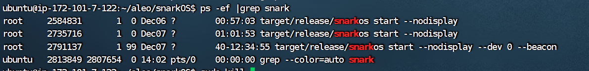

# Aleo

December 13, 2022 初版

目前节点之前的p2p协议存在间歇性断连的问题(PeerRefresh)

目前无法自己启动beacon node或者validator，所以只能使用8个官方的bootstarp node

尝试采用断连后切换节点的方式，结果发现8个官方节点之间的同步的情况都很差，有的时候差几十个高度，这样会导致prover证明的时候出现问题

最后还是暂时接受它间歇性断连的问题，不切换节点

January 10, 2023 

由于间歇性断连的问题严重影响了收益，会产生大量的孤块无法commit给节点，导致矿池的持续性亏损，所以还是打算进行大规模重构。

将特定版本的aleo节点（可以同时维持20个和节点的p2p节点）进行了修改，将所需复写的方法都从private修改为pub，将其暴露出来方便重构，并且将修改后的aleo节点存至本地，作为一个依赖库供aleo-stratum使用。

重构aleo-stratum中和节点连接的部分，置入旧版本完整的prover，修改获取到puzzle后的逻辑，将多线程降级为单线程，强行注入多个Trusted_peers，保证多个连接一定在进行中。

大体重构完毕，整体流程正常，剩余部分优化点。

## haruka矿池协议

```bash

->{"jsonrpc":"2.0","id": 1, "method": "mining.subscribe", "params": ["hentai8.123", "AleoStratum/2.0.0", null]}

<-{"jsonrpc":"2.0","result":[null,null,"aleo1p4jjees0xj2m6hxlgej776elcm74lwlj4m3xuqk9f6zq64zjwgpslkwd42"],"id":1}

->{"jsonrpc":"2.0","id": 1, "method": "mining.authorize", "params": ["aleo1p4jjees0xj2m6hxlgej776elcm74lwlj4m3xuqk9f6zq64zjwgpslkwd42", "123"]}

<-{"jsonrpc":"2.0","result":true,"id":1}

<-{"jsonrpc":"2.0","method":"mining.set_target","params":[256]}

<-{"jsonrpc":"2.0","method":"mining.notify","params":["08020000","08020000915b02bb59efc725bc9fe3607681f6fc7130f8e0f84aa6a124ea79c841cae802ff1f0000",null,true]}

```

notify: 40B

 epoch number 4B, hash 32B, degree 4B

## aleo-pool协议

```jsx
->{"jsonrpc":"2.0","method":"mining.subscribe","params":["ABMatrix_ZKWork_Miner","ABMatrix/0.4.0",null],"id":0}

->{"jsonrpc":"2.0","method":"mining.authorize","params":["hentai8","test_miner",null],"id":1}

->{"jsonrpc":"2.0","method":"mining.local_speed","params":["54.28"],"id":93}

	<-{"jsonrpc":"2.0","method":"mining.notify","params":["3f200100_20010000_17c87e9d-680d-4289-a5d7-f60701c8c3ea",1000,"2001000087329bc1cfbede0ff2b33db3c93372ad71336483d3979bcb55e4a1925575a706ff1f0000","aleo1y2vft8fz8uaardpgvw77fcvv7u6yn2l8e98zwte0cxcsaytvv5yqe424z9",true]}

->{"jsonrpc":"2.0","method":"mining.submit","params":["3f200100_20010000_17c87e9d-680d-4289-a5d7-f60701c8c3ea","2298959d223f3bd1b42863bde4e18cf73449abe7c94e272f2fc1b10e916c650840fadbb0e72448ec741e6094879847dafed197234ec07533936e5931993a88ccf25df5c8753b3bacd2dcbd115b0af0f28b6561f6f6ef470127b1f90f1129e4906df4f39521c14c33a83bf90c20a857415f1ee0a29aba9391e0bc210c1254d6292ebf6209202e008000"],"id":90}

<-{"jsonrpc":"2.0","result":true,"id":90}
```

submit: 137B

address 32B, nonce 8B, commitment 48B, proof **49B**

## n-stratum部分数据存储

```jsx
MYSQL: initWorker(conn.puid, conn.workerId, conn.workerName, conn.ip)

REDIS: redisClient.hincrby(`${coin}:workers:reject:current`, `${conn.puid}:${conn.workerId}`, conn.difficulty）

REDIS: ['hincrby', `${coin}:workers:accept:current`, `${miner.puid}:${miner.workerId}`, miner.difficulty]

REDIS: ['hset', `${coin}:workers:lastShare`, `${miner.puid}:${miner.workerId}`, `${miner.ip}/${nowSeconds}/${miner.workerName ? miner.workerName : ''}`]

MYSQL: saveBlock(job, hashHex, miner.puid, miner.workerId, miner.workerName, job.id, loggers.pool, fees, nonce_hex, data)
```

**修改为**

```jsx
REDIS: ['hset', `${coin}:initWorker`, `${conn.puid}`, `${conn.workerId}/${conn.workerName}/${conn.ip}`]

REDIS: redisClient.hincrby(`${coin}:workers:reject:current`, `${conn.puid}:${conn.workerId}`, conn.difficulty）

REDIS: ['hincrby', `${coin}:workers:accept:current`, `${miner.puid}:${miner.workerId}`, miner.difficulty]

REDIS: ['hset', `${coin}:workers:lastShare`, `${miner.puid}:${miner.workerId}`, `${miner.ip}/${nowSeconds}/${miner.workerName ? miner.workerName : ''}`]

MYSQL: saveBlock(job, hashHex, miner.puid, miner.workerId, miner.workerName, job.id, loggers.pool, fees, nonce_hex, data)
```

workerId生成方式：

```jsx
const getWorkerId = function (str) {
  var md5 = crypto.createHash('md5');
  var temp = md5.update(str).digest('hex');
  temp = temp.slice(0, 13);
  const num = bignum(temp, 16);
  return num.add(Math.pow(10, 17)).toString();
};
```

修改为：

```jsx

```

## account key

```jsx
Private Key  prikey
     View Key  AViewKey1gbQYtbZkQ7HNQsFrezu2uXXdJzGyaTghmiKA2Qb6tBfy
      Address  aleo1p4jjees0xj2m6hxlgej776elcm74lwlj4m3xuqk9f6zq64zjwgpslkwd42
```

## 四种运行方式: beacon,validator,prover,client

## 运行

```bash

# run-client
cargo run --release -- start --nodisplay

# run-prover
cargo run --release -- start --nodisplay --prover prikey

```

## prover的输入参数

```rust

epoch_challenge: EpochChallenge {
    epoch_number: 294,
    epoch_block_hash: AleoLocator { hrp: "ab", data: 3441452135998746423417518347308389270883448382775255378353779086498241434677field },
    epoch_polynomial: 多项式
		epoch_polynomial_evaluations: Evaluations {
        evaluations: [ 多项式算出来的值 ]
  }
}
rand::thread_rng().gen(): 随机数
prover.address(): aleo1p4jjees0xj2m6hxlgej776elcm74lwlj4m3xuqk9f6zq64zjwgpslkwd42
latest_proof_target: 185228
```

## 节点message通信协议

### 建立连接

```bash
# Sending 'ChallengeRequest-A' to '134.122.95.106:4133'
self.id: 2
serialize bytes: [
    2,
    0,
]

deserialize bytes: b"\x03\0\0\0\0\x10\0\0\x02\0\0\0\x01\0\0\0%\x10"
message: ChallengeRequest(
    ChallengeRequest {
        version: 3,
        fork_depth: 4096,
        node_type: Validator,
        status: Peering,
        listener_port: 4133,
    },
)

# Received 'ChallengeRequest-B' from '134.122.95.106:4133'
# Sending 'ChallengeResponse-B' to '134.122.95.106:4133'

self.id: 3
serialize bytes: [
    3,
    0,
]
deserialize bytes: b"\0\0\0\0\0\0\0\0\0\0\0\0\0\0\0\0\0\0\0\0\0\0\0\0\0\0\0\0\0\0\0\0\0\0\x9b\xfb\xe8+|=\xce\xda\x0f1h{\x86?\x8a\xd5x\xb7\"\xe9\x12\xdesV\x1eDK\x88\x8dB\x9e\x0c\0\0\0\0\0\0\0\0\0\0\0\0\0\0\0\0\0\0\0\0\0\0\0\0\0\0\0\0\0\0\0\0\0\0\x03\0\0\0\0\0\0\0\0\0\0\0\0\0\xff\x03\0\0\0\0\0\0\x08\0\0\0\0\0\0\0\xff\x03\0\0\0\0\0\0\0T*c\0\0\0\0\0T*c\0\0\0\0"
message: ChallengeResponse(
    ChallengeResponse {
        header: Buffer(
            b"\0\0\0\0\0\0\0\0\0\0\0\0\0\0\0\0\0\0\0\0\0\0\0\0\0\0\0\0\0\0\0\0\0\0\x9b\xfb\xe8+|=\xce\xda\x0f1h{\x86?\x8a\xd5x\xb7\"\xe9\x12\xdesV\x1eDK\x88\x8dB\x9e\x0c\0\0\0\0\0\0\0\0\0\0\0\0\0\0\0\0\0\0\0\0\0\0\0\0\0\0\0\0\0\0\0\0\0\0\x03\0\0\0\0\0\0\0\0\0\0\0\0\0\xff\x03\0\0\0\0\0\0\x08\0\0\0\0\0\0\0\xff\x03\0\0\0\0\0\0\0T*c\0\0\0\0\0T*c\0\0\0\0",
        ),
    },
)

# Received 'ChallengeResponse-A' from '134.122.95.106:4133'

# Sending 'Ping' to '134.122.95.106:4133'
self.id: 7
serialize bytes: [
    7,
    0,
]
# INFO Connected to '134.122.95.106:4133'
deserialize bytes: b"\x03\0\0\0\0\x10\0\0\x02\0\0\0\x01\0\0\0"
message: Ping(
    Ping {
        version: 3,
        fork_depth: 4096,
        node_type: Validator,
        status: Peering,
    },
)
# TRACE Received 'Ping' from '134.122.95.106:4133'
# TRACE Sending 'Pong' to '134.122.95.106:4133'
self.id: 8
serialize bytes: [
    8,
    0,
]
deserialize bytes: b"\x01"
message: Pong(
    Pong {
        is_fork: Some(
            false,
        ),
    },
)
# Received 'Pong' from '134.122.95.106:4133'
```

### Puzzle交互

```bash
# Sending 'PuzzleRequest' to '134.122.95.106:4133'
self.id: 9
serialize bytes: [
    9,
    0,
]
serialize
deserialize bytes: b"P\x01\0\0\x04\xac\xa3\tOp\xa0Q\xdf\x94\x93)\x10Jum\xdb\x100~)\xc8\x1f\xf8\xf7\xe02Q\xcb\xce\xd9\x08\xff\x1f\0\0\0\0=\xfb7y\x1d\xafZ~\xa2r\xbb\x1f+\x15-\\\xda\xc4A\xea\xf1l\xe9\x82\xack\x1b \xf4q\x05\r\xa8\xe4\xaf\xcb\x07.\xdb\x8f5\xdfM\xa6\x8e\x14\x982Q\xc5\xb8<\xddQ\t\xbd\xd7q\xbdd\x1b\xb8\x07\x0b\0\0\xe3\xb6\xe7\x9av\xd3\xa24\xadb\x01\x99Sd\x9c\xa5 H\xc4\xc5\x88\xe5\xfeA\xda\xd0\xf0\xb6\x1d\xdc\x0c\x11'\x8ce\x9fi\xa4%\xa8\xbeSiM\x85w\x15^Y\x88\xc3\xc3\x86y\x98G\xad\xabB\x07?\xc3\xc4\x0e\0\0\0\0\0\0\0\0\0\0\0\0\0\0\0\0\0\0\0\0\0\0\0\0\0\0\0\0\0\0\0\0\0\0\x03\0sP\x01\0\0\0\0\0sP\x01\0\xc3\x87\x83\x02\0\0\0\0\x10\x07\x05\0\0\0\0\0\xc1Lr\x02\0\0\0\0\xe0\x11\x7fc\0\0\0\0\xef\x11\x7fc\0\0\0\0\0\0\x01\0\0\0\0\0\x01$\xae\xb3$\xa6\x7f\x1f@(\xacw\xf5\xce\x7f\\G\x95x\xda\x0e4hQ\xd9\xd6\x1ct!\xd0\x14E\x0b\0\0\x01\0\0\0z\xe7\xa6\x8d:\xddm\xf6\xbb\xe6\x94\x0eyg{\xd5\x8b\xf1g`ci\xdaNFv\xae|h\x85\"\x0e\x07credits\x04aleo\x08transfer\x03\0\x03\0''+\xa8D\xac\x9c;Rw\x9a[\x84\xe4M.\\x\x82U\xdd\x97\x9e\x95\x08v\xbf\xfa\xbdH+\x06\xf6S_\x01\x87\xea\x87\x9a9\xd0,\\\x95\x9aogS\xa2L\xb1\xe7e\xee*\x9e\xab\x0e\x99\x1c\xb1\x1c\x06\x02\0+\xe6;\xe3\x80\xd40H\x07\xb6\xc5P+\xdaMY\xc9\xdf\xde\xb4bV\x14E\xb3\xc9\x83\xfc\xb2I\x9f\x05\x01\x02\0\xb71\x81\x97\xdd\xc3\xad\xa2\x1b\x1bt\x89\x8cf\xe7\x96\x94t\0rw?+l\xe9\xdd|\xa5X<\xc1\x0fx:\x08\x91\xd6wnb\xf4\xe6\x80\xe3[9\xca\xdd8t9\x8aR\x85\x07l\xce\xaa\xce\xe5Z\"\xab\x02\x02\0\xe7t\xf1\xa9\xf6\x85\xa2\xfc\x01\xe5\x92\n\xf9\xe9\xb9\x96\x02\xc8\xa4\xf1\x8b^\x01\x13\xcc\xb0\t\xba\x96\xb3\xdf\x11\x01\x01\0\x9a\xe6\"\xd7\xcc\x06#^v;\x9eu\x9cI\xb8\xc9\xe2\xed[c\xcd\xad\xcb\xf7(Z\xf4#\xf0\x89\x16\x07\x02\0\x03\0N\x7f\xad\xba\xa0\xf5\xe3\x8f\xf3\x17\xb8!\x81A\x14\xd1\xeaJ7:\x08QQA+~D\xce5+\xd4\x01\x04\x0c\x80uv\x9c\xd1#\x9b\xa8:\xb0\xd2\x02 \xd9w\x1d\xb3\x13 \xe70N\xec\x0f\xd7\xfdD?X\x0b\x01\x01\x01\0\x08\x1f\x96\xb1\x1f\xacQ\xfdXa\x93\xbb\x19\xb0\xf7-\x8c[0W\xcd\xe5\xf5=V6\xd5\"\x9c\x8e\xfd\x0f\x01\x01\0\xf6\x94\x05D\x99\x9b\x17\x03R\x07\xceP\xd7:C\x8dU\x013\xdcd`\x90?\xad6d\xa8\xcc\xd3V\x05\0\xefn\x10u{\x85o\x06b\x8a\x13 \xad0z\xa4\x03\x12G\x01\xd2\x17\xf5\xb6$\xc3Y\x0cx\xbd\xfa\t\x03\0)\x90\xa2\x0c)\x87*~\xfe\x1c\x86\0\xb9\x02\xaf\xa5\x96}\xb7Y\xa2S\xa5\xda\x90\xcb\xdaw\t\xc6\x0c\x11\n?\xe4\x8d\x9d\xb3/\xa8U\x1a\x16N\x8b\xaa~\xcd2\xe0JZ\nN\xf3\xb7\x04iJ\xa740\xa0\x0e\x01\x01\x01\0\x9e\x99\xa6\xa2q\xe9oc4\xe4N\xfa\xbc\x02B\xd6#\xa8\x0f\x15\x96&7\xa9KK\x08\xfa\x91\xbf\xea\x06\x01\x01\0jrj\x02\xf7\0K\xfd\xfco,\x9c9(\xd4\xad\xf5\rf\xf5\xb2d\xd712\xeb\xdf\xd6\ny\xe6\x05\0vc03\xecj`W\xf8.\x1c.P\xa0\xa1\xb9\xb8\xbaO\rU\xba\x0eX\xeb\xbd\xa8.93\x80\x0f\0\0\0\x01\0\0\0\0\0\0\0\x0e\xa5\xfeD\xa9[\x95q\xd8\xc9\x14*\x8e\xc7\xdc\xac\xf0T\xe5\xac\x1a\x81\xbd#\x0c\x93\xf7\\vQ\xb1\x06/~\xe8\x85?\x85\x1fe\x0c]\xa4\n\xd8\xec\x17\x01\x04\xefG\xc1\xc8x\xb7\xba\x8d\xa1\xdb\xc9\x82\xed\x1e\x0c\xd4:c\xd6\xfdPt\xb0\x0c\x80bXrs\x92i\xa2\x058\x05\xce\xdcb\xfa|y_\\9\x1d8\x80 \xf10\xa9\x92\x19h\xcd?\x80\x10\x82\xfe\xa4up\xe5\xb5K\x10!\xf0OU\x10s\xd9c\x17\xd9P\xad\x06\x8c\x91#\x18!C\xc2\xccy\xa6%\x86\xc7\xd0\x80\x01\xf2&\xdcUB$\x80n@\xea\xc6\xd1\xe5\xd3^w\x80\xff#>\xa2\x86\x1bJ\xc2T\x98\x14\xe6\xb6\x8b,\x08\x95\x993\x95U\x1503\xd81\x85\x02\x11F\0\x12\xa6\x9d\x9d\xc1\xe5\xe9\xa4\x82\xf4\xf4\x94\x16\xb9\x0b\xa4\xe3R\xf0\x8de\xf2\xf3\xf1\x82\x9a\xf5\xe9\x94\xe4\x99q\\$A\xd7\xc8P\x9d\x1a\xc6)2\xeb\x96xS\x80\x10@\xe4\xa6=\xc6\xe6\xf9\x8c\x97{Z\x8d\xf1X\xa4\xc8\xc4R\\\x85\xd5\xab\xb9\xd2\x1a\x01>\x0c\x8f\xde!\x96\x87s&.I\xacK.\xa4gt0\0\r\x01e\xe0>o\xd3S\xa5\x9cH\x06j\xd6\xe0\xdb\xa1\x1b\xc1~c43\xe1\x89:D\xec^B\xe4\xea&k\xe7\xd6\xe2\x9e\x13Gz`\xceG4\xa3\x86-w\x81\x80T\xdba\xb2\xfd\0\xe2{[m\x909>d\r\xb2\xb9\xee\x86\x1cqd\xe4\xbc\x15\xfc\x1f7b\xe0.j\x90\xa8\xa56\x85\xff\xc0y\xc1\xd3\x1f\xec\xc4\x86\0lcV\tK\x13\xb8\x94'\xf5\xe5\x88\\\x0e\xcb<\x9b\x1e\xa5\xdf\x17\x9dO}\xe1\xbf<\xccX\xe1\x93A\xd5,\xcbp_z\xa0\xf4\x1b\xd8\x17j\xfe\x85\xc2\x80\x8e\x81$\xadZ\xc6\xfe\x80Zz\xc2)\xdd\x19c\x03\xd7 \x81y\xd9\xa5\xdd\x97\xa3\x91R\xceh`\x8fM\xfe\x1b\x1c\xd6\x99U/;\xcc1\x08\xd5\x8b\xf4A\x01\xef\xc1I[\x8fuZ\xe9\xc0\xdd\x0e\xd4\x15\x85(\xc1#a\x04L\x08\xfcn{\x82CP\xef\x1e\0\xa9\x0e\"\x08\xc8\xe4\xb6\xc2r/\xdb\xda\x19\xfb~\x16p\xf3\xd1\xdb\xea:X\xa9\x07\xb2\x07\xf2\xb0!\x9a\xf6p\x10R\xa4\\\xf7\xf04\x02<\xbbJ\x13$j\xda\x0cRPL\x14\xc96\x9a\x03\xab\x81\x83Q\x8c/\x16\xd5\x0b6\x81\xbb\x19|\xcb\xde*)l\xf51\xe3\xaa`\xad|/\x16\xb5\xe1\x90\xea\x8c^i\x8fv\xd6\xc8\xbd\x0e\xcc\xe4\xa1\xdc\xc5\x06Z\r\x0b\xfde\x0f\xed~@w\xcdb\x01\t~\"g\x14\xb7\x9a\xdfN%J\xcc\n\xd9!\x8b\xe1AsVp\x82\xe4{\x80>\xd1n\x02.\xb0\x8c\x18&S\xde*l\xe8<\xffe\x020\x11\xdf\x11x\xb5U\xac\x9ac\x7f\xfcmR\xa1{\xc1\x14\xf3\xdb\xeb=\xf5\x07n\xb8\x1b\xd2\x03K\x02\xa4\x8b\x11\xec\xe4\xc9 \x9b\xdd\xedQv\xcd\x0e)\"\xe2I\\\xd9\xbf\xba\xec\x17\xd5\x89o\xba\xe8orut\x82\x06\x02\0\0\0\0\0\0\0\xa0\xf1-\xd8\xdbur\x10\xf7\xe8\xe9\x16\0;\xe1\x92\xda\x06\xcb\x07\0\x89\xabL\xd8\xff\x89\xb0\xfc3S\x8cQ|\x15\xb0\"\xe1B\xa9\xbb\x96\x90\xb5\xfd\xfd\xc0\x80\x01\x9f\xc4\xe8J\xe9\x0b\x02\x82F\x9fD\xf1\xc9{zR.\xb8\xda\xc0';\x85c\x87b\xf0\xc4\x15\xca\xa9\x0c\x1f[\xbas(\xb28~\xed\x0e\xd3\xd6\xc6\x1c>\xbfPfq}\x11fs\xff\x93KO\x01\x0b\0\x80!\r\xb4\xe3\xe5\x0b#!\xfdq\xfa\xdb\xcf\xcc(\xfc\x80\0\0\xc9\xb2\x86\x14\xaf%\xfeqP=\x05un2\xea\x02\xe0\xed\xd5\"\xa8\"$\xa3{S\x94s\xc1c\xd7\x05\xc7 Eih\x814\xb5\x8fH\x08KS\xfe\xe4u4,4T \x1d\xc99\xdc\x0e>\x14\xe9H\xd5\0\0\0\0\0\0\0\0\0\xe3\xb6\xe7\x9av\xd3\xa24\xadb\x01\x99Sd\x9c\xa5 H\xc4\xc5\x88\xe5\xfeA\xda\xd0\xf0\xb6\x1d\xdc\x0c\x11\x01\0\0\x01\0\0\0\0\0\0\0\xf1c_\xf3R*\x93mh\xd5j\x82\x8a\x8c\xa4D?\xdc\x88L\x19P\xd3\xf3\xdd\xe0\x1b\x89\xf9Q\xaf\xd2~\xd77\xf8>o\x82\xe0\xe6\xce\xfa\x1e/+\xf5\x80\xaaE\xb5\xb0u\x87\xcbdl\x8eH\x05\x93\xc8C\xfb\x02[\xe7!\xa5X\x0ef\xdc\xce\xc7U\x9f\x16R\xe5:\x9e\x17\xb4\xd9\x05\x8d\x031r\xb5\x1b\x96h@\x81#\xd8KK\x0e\x19\xb7\x89\xf0\x90\xc3\xd7cu\x96\xc5\xa8\x87\x01g\xea\xfa`\x05@\x81\xcdJ\\r@}\xc9p\xeaJ\x9d\x11m\xe1\xdc\xfa\x0f\xd4\x1al\x1d\x01\x01\xad\x1es\x0c\xc2\xaa\xbeJL\x89\xab\xbe\xe3+n\xf8\x1a\x89_\xa9\x81{\xd7w\xa7\x88:\xfafg\x0eZu\xe6\xfa\x90Gwk\xbe\xd0}\xb8\xa0\xa1\x01N\0\xe2\xab\x8eb\x1eBz\xcf\xd2ty/\xccg\xf1;\xee\x1f\xf4T\xa4\xb9\x80\x92+\x19\x03\xcb\xdc5\x7f\xbc\x11:\xfe\x1a\x1fe\xd9y\xd63\x8a3\x93\xf7\xbc\0\x1a0{!\x99\xc9\xf6\xf6 y\x1c\xca?Q9\x9f\xf0y\xc4\x12\xb0c\xe9-!\x95\xa9\xdc\xf7Zh \xa3H\xda\xb0\x9cm\xbd_\x8eH\xbbnO\xb2h\x01\xf7\xc9\x9d\x189h-\x13\xaaE\xa39\x9a=\xb3\xf7\x89\0T\xb6\x18\xac\x86\xd3~\xb3\xd8.\x1cO\x1a\xe4$\x96\xb6\xb8\xf5\xb6O\xb8\x1c3\xc5\xb3^\x7f\xd3\x803\xe9\xde%n\xdb6\x1bAl.n\xa6/\x97p\xecmt\x1d\xe6\xb6\xcc.\xf0\xb7E\xf0.\x96\xda!\x97..$6\xe8^l\x9e\xb4\x04H\xd4\x06\xde\0aRh\x95yv@\x19\x88E7X\xb6\xa0\x88\x16\xe4Es\xa4\xb6\x98I\x0c;\xf3\x9e$\x98\xa95#D\xb5\xd9\0oo3\xfd\xae\xd3\x83|*\xd3\xa8\x01\x05g\x99\xba\xaeG\xf5hd\xf5\xa9\xb6pA<b\x1d\x9f\xf6\xd7=\x13\"\x10\x92\x19\xba\xfd/`\x0cq\x0bK\xd8}\x90\x04\r\x88I\x10\x134\xfbY\xad\0\xfb\xa3>=ZG\xf6\xd3\xa6\xf6\xc4\xb21b\x8d\xd7\xd1},\x96\x89\xd7\xa7\xe5\xcc\xbbp\xb0\xb6d\x14\x0c%?\xaf\xd8\x0e\xb8\xdfK\x1f!\x9fr+\x98\xabr~\x84\xb3\x94\x86\x8c\x1a\x82\xdcIJTB\xd7W\x12\xbdw\xa1\xa4\t\x99)\xcaK;x\x98\x12x\xe4\x88\xa4\x98T\x02\x14\xb8\xa2\x91\xd5g\xdc\xa0\x9fY5\x05C6\xedC\xe5=q\x95jY\0\xb2\xa7\xffh\x93\xb1\xf2\x03\xa6Jh\xb5\x11\x9c\xf3\xcf\xcd(c\xd1\x03\xf5\xb2\xae\n\x9eA\xd5\xd2\xb6\xb6\xaf)\xab\xd9?T\t9\x97f\x05\x8a\xd5\x9f\xd8'!}\x01\x18v\rG4\x95\x95\x1b\xf9\xe5\x01\xf5\xa5\x0e+O\xe6\x15\xd6\xa0v}\x83Z\x8d\xa9|j\x9c\x9f\xf3\t\x80\xeb\x0f\x9e\x92\xec\xe7\xf7gTN\x14\xaf\xaf\xf1\x97d,n\x08\xea\xc7\xd7]H \xb0\x86\x94\x0c\xcb\x1e\xf8I\x0f\xf1hj\x90\xbe\xec\xf2xFW\x7f\x8c\xb2\x82\x85\x7f(\x9e\xb8\xd4y\x9c@\x12`\xde\xe2g\xaaM\xcf\x08\x02\0\0\0\0\0\0\0\xb3\xf7\xd6\x0b\x82\xd3P\xc3\xb0\xcc\xb77\xdd0\x80\xb0\x1e\x0b'$\x92KY0\x1f\xc5i\x8f\xb4\x85\x1e_\xb6\x1a\x1e\x03Z\x83\xe0\xbc\xaaAZ\xd7*\x9e@\x81\x01lwHY\x92\x19\x06\xc1*\xab\xd0\x9dJ\xa0\xce\xe5\xe1\x0f\xd4`\xce\x85\xde\xe86\xa3\xa3\xf1\x172\x0e\x0f^ \x13\xc4i\xa9_\x11?\xe4^\x15\xc1\xba\xda\xd4,\xb8\x84\xb1\xd2D-r\x08\xe9=\xc5=e\x99n\xdf;\xc6=\x83\xf6\xe9\x9fVh8A\x9eS\xca\x80\0\0\0\0\x07\"}CIB\xc7\xb5a\xd9l\xe4\xc5\xc8cY\xa9\x9f\x1a\xb2\x02\x88\xfai\x96g\x03\x8a$x\xf1\x02\x93\xe5\x8d\xc6\xcd\xd6xVR\x15\x93eP\xd1\x80\xc6\0x\x10\xd4\xc6\x83\x18\x0b\xd3W\x8d\x05\"\xadv\x01~\x1f\\\xc8A\xadK\x1f\xe3\xb9wh@I\xa7\x91\x95\xe8\x0c\x8f\x9c\x0c<\xbf0\x9f\x84dlbd\t\xbbAR\x9d\x9cD\xe6\x97;Q\\9\x1ba!6\xe4\xff\x1f\xc5\xd6+\x8fJ\xbb\x97rsvFT\x04"

message: PuzzleResponse(
    PuzzleResponse {
        epoch_challenge: EpochChallenge {
            epoch_number: 336,
            epoch_block_hash: AleoLocator { hrp: "ab", data: 4003335842890878736995934974476647458468089897448734935229804677019275078660field },
            epoch_polynomial: 多项式
						epoch_polynomial_evaluations: Evaluations {
                evaluations: [多项式的值]
				}
    },
)

# Received 'PuzzleResponse' from '134.122.95.106:4133'
```

### 然后prover就可以开始计算

```bash
Proving 'CoinbasePuzzle' (Epoch 336, Block 86131, Coinbase Target 42174403, Proof Target 329488)
prover.address(): aleo1p4jjees0xj2m6hxlgej776elcm74lwlj4m3xuqk9f6zq64zjwgpslkwd42
Prover solution was below the necessary proof target (1 < 329488)
```

### 计算完后提交

```bash

```

## 矿池实现方式

将矿池伪装成prover，与节点做p2p连接

接受到puzzle后，降低难度，拆分后下发给miner

Shall I ask you a question? Do you know how to convert target to difficulty in aleo? Is it the same as btc?

## aleo-pool-server

采用nightly方式build以及运行

```bash
rustup install nightly

rustup run nightly cargo build

```

```bash
rustup run nightly cargo run -- --address aleo1p4jjees0xj2m6hxlgej776elcm74lwlj4m3xuqk9f6zq64zjwgpslkwd42 --port 9090 --api-port 9091
```

```bash
rustup run nightly cargo run -- --address aleo1rhf44cafzpkfdtqju2x000qa4gazgqz4vq55nazvmtcr2e8snuxqn5wn2t --port 9090 --api-port 9091
```

target/debug/aleo-pool-server --address aleo1rhf44cafzpkfdtqju2x000qa4gazgqz4vq55nazvmtcr2e8snuxqn5wn2t --port 9090 --api-port 9091

## n-stratum数据结构

blocks_records

```bash
id
puid
worker_id
worker_name
job_id
height
chain
nonce
is_orphaned
hash
rewards
fees
size
prev_hash
bits -> mini_proof_target
version
timestamp
created_at
updated_at
location
-> commitment
-> proof
```

## 存储在redis中的数据结构

```jsx
prefix-key: {stratum}:aleo:

// authorize后
key: initWroker
field: {puid}
value: {worker_id}/{worker_name}/{peer_addr}

// share被reject后
key: workers:reject:current
field: {puid}:{wroker_id}
value: {prover_target}

// share被accept后
key: workers:accept:current
field: {puid}:{wroker_id}
value: {prover_target}

// 出块后
key: successSolution:current
field: {height}:{commitment}:{proof}
value: {puid}/{worker_id}/{worker_name}/{job_id}/{prover_target}/{mini_prover_target}/{nonce}/{prev_hash}/{version}/{reward}/{timestamp}
```

## 收益计算方式

[https://www.aleo.org/post/testnet-3-incentives-kickoff](https://www.aleo.org/post/testnet-3-incentives-kickoff)

参见浏览器

[https://explorer.hamp.app/block?bh=ab1mnwfqu7n6kn6fv6qmqq5xue9vdanu53heyahth0gvgxgdxpsu5gshyv430](https://explorer.hamp.app/block?bh=ab1mnwfqu7n6kn6fv6qmqq5xue9vdanu53heyahth0gvgxgdxpsu5gshyv430)

```jsx
{"id":22,"jsonrpc":"2.0","method":"mining.submit","params":["hentai8","6f020000","b407000000000000","c7260910e935f99b9cfa198de9a0c4b46abc40778e837de121e2d0fa9135da024175910c3087f6ffe04971fffd41930100","17d3d700eda8aa5fd084dda6e75c446b24cad1fb6385413af94e6b5ef771351a4b7191ced42d828d559ce363976e8c0000"]}

```

right

```jsx
{"id":2,"jsonrpc":"2.0","method":"mining.submit","params":["hentai8","6f020000","1f00000000000000","9545f1c393cc83ef92ae6db391a34d7becc22c42683347ee09bb301a83932bd853516f42107a33b8848fe17a3ed2048000","9e323f90773b31dd1fa25ee6d0b5feafa1a9ca2860d85e1916d3efe9732ce97c699ae4e3e701784065d5b60e3ff9a60100"]}

{"id":3,"jsonrpc":"2.0","method":"mining.submit","params":["hentai8","6f020000","8800000000000000","0ca6a63e9c438941b855d242374da270901541d7bedb45d1f18daca6f540b1e1ce418a9d15595ad5d1d55bc73300d68000","0e7f703aae32bb2e1842d142c402d3dd56f2d4adab38462565d80e423e1544f8dea6cb5f145585154460cee61889328000"]}
```

error

```jsx
{"id":2,"jsonrpc":"2.0","method":"mining.submit","params":["hentai8","6f020000","1f00000000000000","9545f1c393cc83ef92ae6db391a34d7becc22c42683347ee09bb301a83932bd853516f42107a33b8848fe17a3ed2048000","62c260c2e14640e2cb9b74ba4fc8d599237766b6d6781a080a5323ed6a1b2f5d128bfd0022d2d23dba313da38978938000"]}

{"id":3,"jsonrpc":"2.0","method":"mining.submit","params":["hentai8","6f020000","8800000000000000","0ca6a63e9c438941b855d242374da270901541d7bedb45d1f18daca6f540b1e1ce418a9d15595ad5d1d55bc73300d68000","8088ead48af660c5450dbeb26fe4306f682e544eaf4394f397b582bc391cab5f1d6122fc46016732593b15a6aab3690100"]}
```

```bash
curl -A 'Mozilla/5.0 (Windows NT 10.0; Win64; x64) AppleWebKit/537.36 (KHTML, like Gecko) Chrome/76.0.3809.100 Safari/537.36' --location --request GET '[https://explorer.hamp.app/block?h=169015](https://explorer.hamp.app/block?h=169015)'
```

```markdown


A GPU prover that does not rely the on CPU too much

### How to run
```
./dxa0 -h aleo.ss.dxpool.com -p 9090 -u account.worker
```

### We recommand you to run `dxa0` via [`pm2`](https://github.com/Unitech/pm2), which enables process relaunch when crashed
```
pm2 start -n ap ./dxa0 -- -h aleo.ss.dxpool.com -p 9090 -u account.worker
```

**To check log**
```
pm2 logs ap
```

**To stop**
```
pm2 stop ap
```
```

**DxPool Aleo Miner**
First Edition

- Recommanded OS: Ubuntu
- Graphics Cards: Nvidia

140445

14865490370

aleo1rhf44cafzpkfdtqju2x000qa4gazgqz4vq55nazvmtcr2e8snuxqn5wn2t

207.154.215.49:4133

```jsx
SocketAddr::from_str("164.92.111.59:4133").unwrap(),
                SocketAddr::from_str("159.223.204.96:4133").unwrap(),
                SocketAddr::from_str("167.71.219.176:4133").unwrap(),
                SocketAddr::from_str("157.245.205.209:4133").unwrap(),
                SocketAddr::from_str("134.122.95.106:4133").unwrap(),
                SocketAddr::from_str("161.35.24.55:4133").unwrap(),
                SocketAddr::from_str("138.68.103.139:4133").unwrap(),
                SocketAddr::from_str("207.154.215.49:4133").unwrap(),
                SocketAddr::from_str("46.101.114.158:4133").unwrap(),
                SocketAddr::from_str("138.197.190.94:4133").unwrap(),
```




expected, found 

`UnboundedSender<ReturnableConnection>`

`UnboundedSender<ReturnableConnection>`